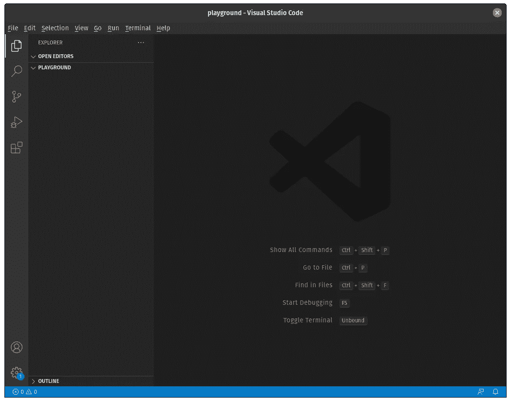
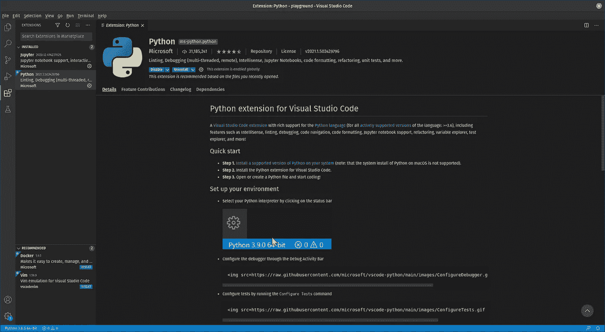
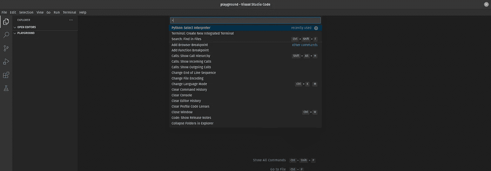
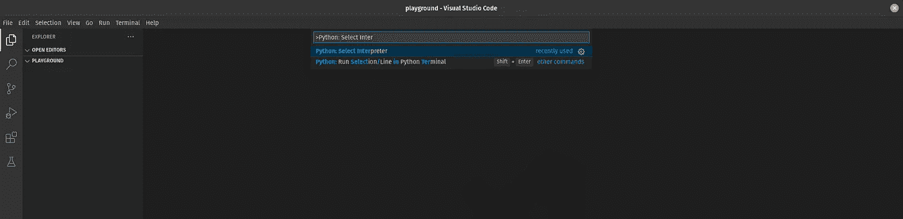
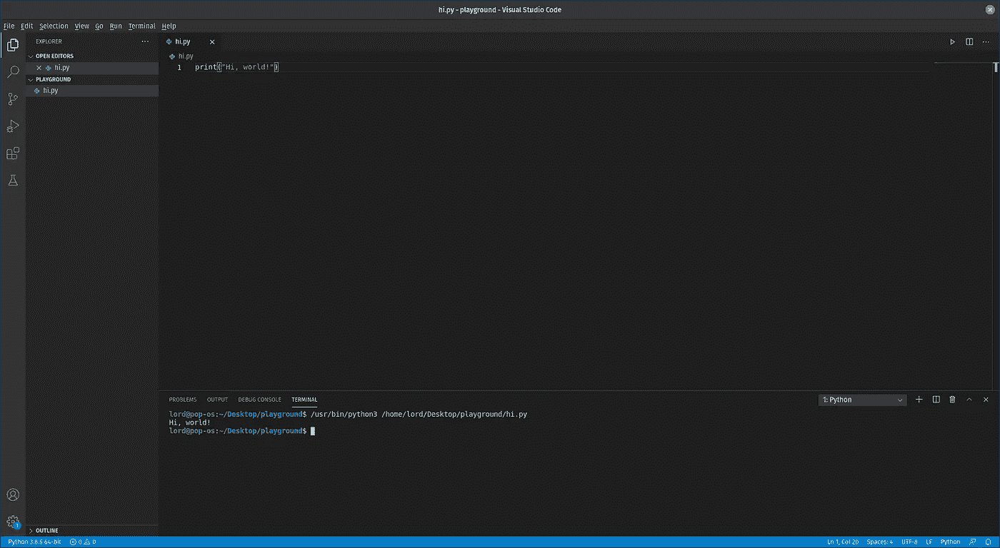

# 用 python 编写 VS 代码

> 原文：<https://medium.com/analytics-vidhya/writing-in-python-on-vs-code-f37d2a48deb?source=collection_archive---------19----------------------->

嗨！让我们看看如何用 Visual Studio 代码开始用 python 编码。

## 安装 VS 代码

首先，为了在 Ubuntu 中安装 Visual Studio 代码，我使用了以下命令:

```
curl https://packages.microsoft.com/keys/microsoft.asc | gpg — dearmor > microsoft.gpg
sudo mv microsoft.gpg /etc/apt/trusted.gpg.d/microsoft.gpg
sudo apt-get update
sudo apt-get install code
```

不然还有[官网](https://code.visualstudio.com/#alt-downloads)从哪里下载。

## 安装 Python

在大多数 Linux 发行版中已经安装了 python，所以没什么大问题。如果你用的是 Windows，在 python.org 的 T2 有一个下载页面。或者，在命令提示符中写入“python”将打开 Microsoft Store 到 Python 的最新版本。

为了**检查安装**是否工作，Python 是否工作，运行下面的命令。如果安装成功，输出应该是您安装的 Python 版本，例如“Python 3.8.5”。

Linux:

```
python --version
```

窗口:

```
py -3 --version
```

我现在的设置是 Pop！_OS 20.04 LTS 和 Python 3.8.5。我将在工作桌面上创建一个新文件夹:

```
mkdir ~/Desktop/playground
cd ~/Desktop/playground
```

然后我可以打开这个文件夹中的 VS 代码:

```
code .
```

你可以在左边看到我们在操场文件夹中，现在是空的。



在左边，有一列符号。按下最后一个，有方块的那个，“扩展”，搜索 Python 扩展并安装它。运行 Python 代码需要它。



Python 需要一个解释器来执行。这个解释器，在你的系统中，是一个文件，可以有多个，例如，你安装的 Python 的每个不同版本都有一个解释器。VS 代码需要知道解释器用什么，所以我们必须告诉他。按 Ctrl + Shift + P 打开**命令面板**。



然后输入 Python: Select Interpreter。



这将显示 VS 代码在您的系统上自动检测的不同解释器。选择您想要的一个。

现在在左下角，应该会显示 python 解释器。这意味着 VS 代码知道他必须使用那个版本的解释器。我们可以走了！

越过“操场”会出现一些按钮。点击左边的“新建文件”，将新文件命名为“hi.py”。

右边，我们写下面的代码，按 Ctrl + S 保存。

```
print(“Hi, world!”)
```

在右上角，有一个绿色的播放按钮。按下它将导致 VS 代码在窗口的下侧打开一个新的选项卡，一个终端，在那里代码被执行并显示输出。



我们的程序已经执行了！

还有很多事情要做。为了在 python 中正常工作，我们需要为我们的工作空间建立一个虚拟环境，并获得一些 vs 代码扩展。但那是以后的事了。

希望这个小指南对你有帮助！祝你有美好的一天！