# 多层感知器异或门

> 原文：<https://medium.com/analytics-vidhya/xor-gate-with-multilayer-perceptron-66e78671acd4?source=collection_archive---------0----------------------->

在这篇文章中，我将解释感知器的一个简单的数学计算来表示一个逻辑异或门。

# 介绍

虽然这是一个简单的概念，初学者会发现它是多层感知器数学关系的有趣开端。

# 先决条件

*   理解感知器。
*   理解阶跃函数。
*   了解重量、输入、输出。

# 说明

双输入异或门的真值表在下面给出，

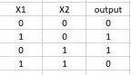

图 1.1:异或门真值表

我们希望得到上面真值表中所示的输出。为此，我们制作了一个 MLP(多层感知器)架构，如下所示。

这里，圆圈是神经元(O1，N1，N2，X1，X2)，橙色和蓝色的带数字的线是用权重表示输入方向。箭头上的数字代表重量。B1 和 B2 代表偏差。

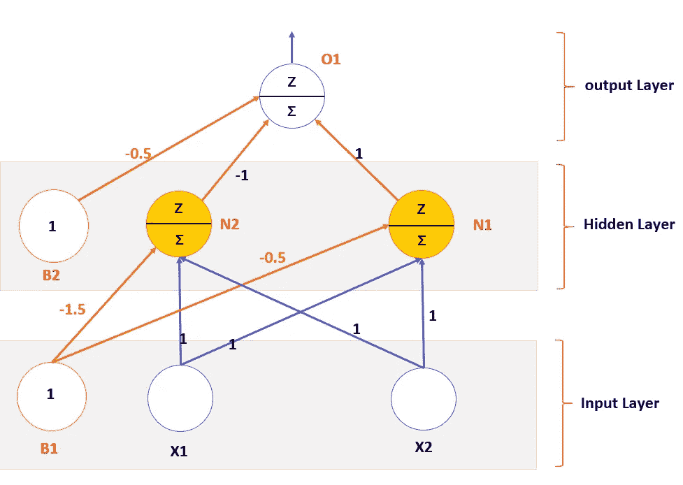

图 1.2:使用感知器的异或门表示。

# 阶跃函数:

阶跃函数(z)仅在加权和为 1 或大于 1 时触发。也就是说，

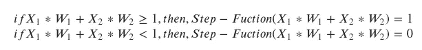

等式 1.1:定义阶跃函数

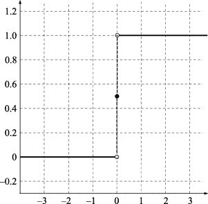

图 1.3:图表中的阶跃函数

# 异或门输出的计算

回想一下，如果加权和的值为 1 或大于 1，则阶跃函数的输出值为 1，否则输出值为 0。

## 第 1 行，真值表图(1.1)，

异或门真值表说，如果 X1 = 0，X2 =0，输出应该是 0。

*为隐层神经元 N1(图 1.2)，*

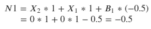

所以，阶跃函数(-0.5) = 0，**的输出 N1 = 0**

*为隐含层神经元 N2(图 1.2)，*

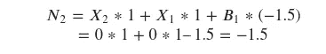

所以，阶跃函数(-1.5) = 0，**的输出 N2 = 0**

*为输出神经元 O1(图 1.2)，*

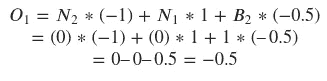

所以，step_function(-0.5) = 0， **O1 的输出= 0**

与图 1.1 相匹配，XOR 真值表第一行。

## 第 2 行，真值表图(1.1)，

异或门真值表说，如果 X1 = 1，X2 =0，输出应该是 1。

*为隐含层神经元 N1(图 1.2)，*

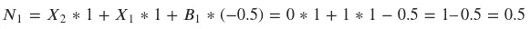

所以，step_function(0.5) = 1， **N1 的输出= 1**

*为隐含层神经元 N2(图 1.2)，*

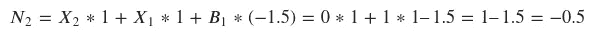

所以，阶跃函数(-0.5) = 0，**的输出 N2 = 0**

*为输出神经元 O1(图 1.2)，*

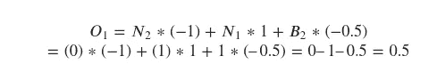

所以，step_function(0.5) = 1，**的输出 O1 = 1**

与图 1.1 相匹配，XOR 真值表第二行。

## 第 3 行，真值表图(1.1)，

异或门真值表说，如果 X1 = 0，X2 =1，输出应该是 1。

*为隐含层神经元 N1(图 1.2)，*

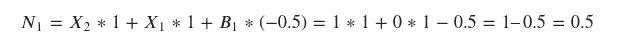

所以，step_function(0.5) = 1，**的输出 N1 = 1**

*为隐含层神经元 N2(图 1.2)，*

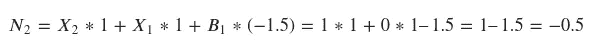

所以，阶跃函数(-0.5) = 0，**的输出 N2 = 0**

*为输出神经元 O1(图 1.2)，*

所以，step_function(0.5) = 1，**的输出 O1 = 1**

与图 1.1 相匹配，XOR 真值表第三行。

## 第 4 行，真值表图(1.1)，

异或门真值表说，如果 X1 = 1，X2 =1，输出应该是 0。

*为隐含层神经元 N1(图 1.2)，*

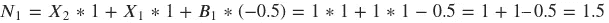

所以，step_function(1.5) = 1， **N1 的输出= 1**

*为隐含层神经元 N2(图 1.2)，*

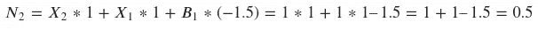

所以，step_function(0.5) = 1，**的输出 N2 = 1**

*为输出神经元 O1(图 1.2)，*

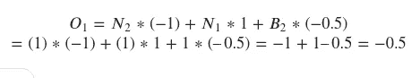

所以，step_function(-0.5) = 1，**的输出 O1 = 0**

与图 1.1 相匹配，XOR 真值表第四行。

# 注意

我在这里使用的权重是预先确定的。在现实世界中，我们必须使用一种称为反向传播的方法来训练这个多层感知器。训练后，我们会得到我们在这里使用过的重量。但是在这篇文章中，我只是展示了如果我们想用感知器解决这样的问题的可能性。我将写关于反向传播的文章，以便将来训练一个多层感知器。

# 结论

对于异或门真值表的每一行，我们发现我们的多层感知器结构(图 1.2)给出了正确的输出。

感谢阅读。