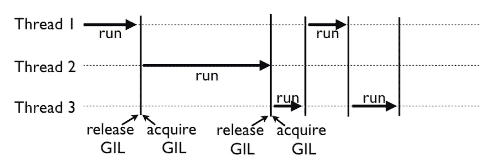
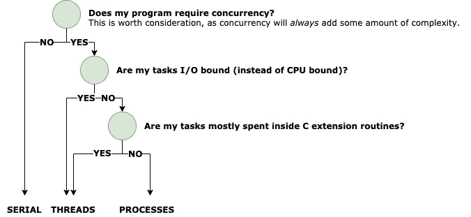
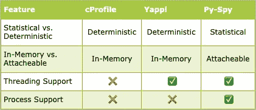

# Python 中并发性的又一介绍

> 原文：<https://medium.com/analytics-vidhya/yet-another-intro-to-concurrency-in-python-5aad2796a766?source=collection_archive---------19----------------------->

Python 中主要并发主题的简单介绍

使用 [CPython 解释器](https://github.com/python/cpython)在 Python 中找到理解和实现并发性的资源当然并不困难。然而，找到*好的*资源可能是困难的。因此，我想为这个主题写更多的“登陆页面”，简要地触及 Python 中并发性的主要子主题，同时只为那些想要深入了解的人提供权威资源(主要是官方 Python 文档和来自维护者的摘录)。


具有讽刺意味的是，通过*创造另一种资源*来解决太多资源的问题，我并没有完全忘记..但是这次会不一样！😅

# 主要模块

熟悉 Python 中并发性的最好方法之一是接触主要的内置并发模块，对于这一点，没有比 Python 文档更好的权威资源了！文档维护得很好，有源代码和代码片段示例的链接。文档中有一页专门讨论了[并发](https://docs.python.org/3/library/concurrency.html)主题，但是有点冗长。对于简单的介绍，我建议首先熟悉如何…

创建一个进程(使用[多重处理。流程](https://docs.python.org/3/library/multiprocessing.html#module-multiprocessing)

```
**from** **multiprocessing** **import** Process

**def** f(name):
    print('hello', name)

**if** __name__ == '__main__':
    p = Process(target=f, args=('bob',))
    p.start()
    p.join()
```

创建一个螺纹(使用[螺纹。螺纹](https://docs.python.org/3/library/threading.html#threading.Thread)

```
**from** **threading** **import** Thread

**def** f(name):
    print('hello', name)

**if** __name__ == '__main__':
    t = Thread(target=f, args=('bob',))
    t.start()
    t.join()
```

对于额外的积分(对于 Python 3.7 以上的用户)，您还可以熟悉如何创建一个协程(使用 [asyncio](https://docs.python.org/3/library/asyncio-task.html#coroutine) )

```
**import** **asyncio**
**import** **time**

**async** **def** say_after(delay, what):
    **await** asyncio.sleep(delay)
    print(what)

**async** **def** main():
    print(f"started at *{*time.strftime('*%X*')*}*")

    **await** say_after(1, 'hello')
    **await** say_after(2, 'world')

    print(f"finished at *{*time.strftime('*%X*')*}*")

asyncio.run(main())
```

Python 库中包含的其他并发抽象，如[执行器](https://docs.python.org/3/library/concurrent.futures.html#concurrent.futures.Executor)和[池](https://docs.python.org/3/library/multiprocessing.html#multiprocessing.pool.Pool)都是在上述类的基础上构建的。

# 全局解释器锁(GIL)

每当用 Python 处理并发性时，房间里就有一头大象；那就是[全局解释器锁](https://medium.com/r?url=https%3A%2F%2Fdocs.python.org%2F3%2Fglossary.html%23term-global-interpreter-lock)，又名 GIL。


GIL 实际上更像是一只海姆达尔犬，而不是一头大象…

## 什么

GIL 是 CPython 解释器的一个特性，它确保*只有一个线程在解释器中运行*(即使是在多核机器上)。在幕后，GIL 只是一个互斥体，由线程传递以决定谁去执行。这种线程锁定模型如下所示:



这里你可以看到一个多线程的 Python 程序，其中只有获得了 GIL 的线程才能执行

释放 GIL 并允许下一个线程运行的三个值得注意的场景是当正在执行的线程…

1.  在 I/O(读、写、接收、发送等)上被阻止。)
2.  位于显式释放它的本机 C 扩展中(例如， [NumPy](https://github.com/numpy/numpy/search?utf8=%E2%9C%93&q=NPY_BEGIN_THREADS) )
3.  执行 100 个“滴答”(“滴答”*大致是*翻译成指令)

## 为什么

这种机制的主要原因是*很简单*。它简化了 CPython 解释器的许多底层细节(内存管理、对 C 扩展的调用等)。).此外，它使 Python 开发人员变得简单，因为他们不再受制于涉及线程竞争条件的一大类问题。

## 我为什么在乎？

当评估你的 Python 程序在给定场景中应该使用什么并发原语时，了解 GIL 是极其重要的，无论是线程、进程、协同程序还是普通的串行执行。例如，使用多线程处理 CPU 受限的任务可能会*降低* *程序的速度*，而不管内核是否可用，这对于任何在这种执行模型之外编程的人来说都是违反直觉的。这将在下一节中演示。

*更多关于 GIL 的信息，请查看丹·比兹利的博客:*[*http://www.dabeaz.com/GIL/*](http://www.dabeaz.com/GIL/)

# 何时使用线程，何时使用进程，何时不使用线程(串行执行)

这里没有灵丹妙药。何时使用线程、进程、协程或根本不使用完全取决于用例。做出这个决定最重要的先决条件是能够描述你的申请*。* 如果不进行性能分析，准确预测性能几乎是不可能的。尤其是当考虑到 GIL 的强加。如果您还没有对您的程序进行评测，请在继续之前跳到下一节以获得相关说明。

假设您已经分析了您的程序，这个决策树可以作为判断哪个并发原语最适合您的经验法则:



这张图展示了——我不是设计师

该树隐含地偏向线程而不是进程，仅仅是因为线程更容易实现。线程已经在同一个地址空间中运行，因为 GIL 将强制互斥，所以不需要额外的工作来管理共享资源。

# 剖析您的程序

剖析可以让您大开眼界，更好地了解 Python 程序的性能。当给定详细的分析信息时，隐藏的瓶颈通常变得容易追踪。幸运的是，这在 Python 中很容易做到。

Python 标准库附带了两个分析器: [cProfile](https://docs.python.org/3/library/profile.html#module-cProfile) 和 [profile](https://docs.python.org/3/library/profile.html#module-profile) ，建议大多数用户使用 cProfile。作为分析器能做什么的一个例子，请看下面这个取自 Python 文档的例子:

```
import cProfile
import re
cProfile.run('re.compile("foo|bar")')
```

运行上述程序后，您会得到如下输出:

```
197 function calls (192 primitive calls) **in** 0.002 secondsOrdered by: standard namencalls  tottime  percall  cumtime  percall filename:lineno(function)
     1    0.000    0.000    0.001    0.001 <string>:1(<module>)
     1    0.000    0.000    0.001    0.001 re.py:212(compile)
     1    0.000    0.000    0.001    0.001 re.py:268(_compile)
     1    0.000    0.000    0.000    0.000 sre_compile.py:172(_compile_charset)
     1    0.000    0.000    0.000    0.000 sre_compile.py:201(_optimize_charset)
     4    0.000    0.000    0.000    0.000 sre_compile.py:25(_identityfunction)
   3/1    0.000    0.000    0.000    0.000 sre_compile.py:33(_compile)
```

这些文档包括一个简单的用户手册，用于理解从这些统计数据中可以收集到的大量信息。

*注意(针对 Docker 用户):Docker 使用* [*Seccomp 过滤器*](https://www.man7.org/linux/man-pages/man2/seccomp.2.html) *来限制容器进程可以进行哪些系统调用。您必须在启动容器时启用* `--cap-add SYS_PTRACE` *来启用 Py-Spy 之类的采样分析器(它依赖于*[process _ VM _ readv](https://man7.org/linux/man-pages/man2/process_vm_readv.2.html))*来探查您的程序的地址空间)。*

## 选择分析器

并非所有的分析器都是相同的。最适合您的 profiler 还是取决于用例。然而，主要的考虑因素通常是确定性的**与统计性的**。

**确定性**剖析器执行跟踪功能，记录所有感兴趣的事件(函数调用、函数返回等)。).这些分析器记录高分辨率的分析信息，但通常会产生很高的开销。如果应用程序有大量的函数调用，分析器将有大量的函数要收集，如果函数很小，由于测量本身的开销，它们的执行时间可能不准确。

**统计**评测器周期性中断程序，采样执行状态。然后分析执行状态(即调用堆栈)。这些分析器不能捕获所有的函数调用，但是它们的开销通常很低(更适合在生产中使用)。

其他考虑因素包括分析器是否在内存中运行(即，将分析器模块导入 Python 程序并选择开始/停止记录的位置)，或者它是否附加到现有的 Python 进程。

下面是一个简单的图表，比较了三个流行的 Python 分析器: [cProfile](https://docs.python.org/3/library/profile.html#module-cProfile) 、 [Yappi](https://github.com/sumerc/yappi) 和 [Py-Spy](https://github.com/benfred/py-spy) :



# 就是这样！

希望这为您提供了足够的信息，可以开始将并发性引入您的 Python 程序！请随意评论或提问。