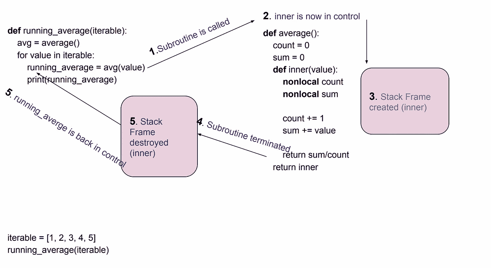

# yield — Python(第一部分)

> 原文：<https://medium.com/analytics-vidhya/yield-python-part-i-4dbfe914ad2d?source=collection_archive---------2----------------------->


照片由[Ali ylmaz](https://unsplash.com/@aliyilmazz?utm_source=unsplash&utm_medium=referral&utm_content=creditCopyText)在 [Unsplash](https://unsplash.com/s/photos/corn-and-insect?utm_source=unsplash&utm_medium=referral&utm_content=creditCopyText) 上拍摄

偶尔遇到的关键字看起来很神秘。在这里，我们通过查看生成器如何使用`yield`来获取值或将控制权返回给调用者，来解开`yield`做了什么。我们也在看发电机的不同状态。让我们开始吧。

**发电机功能**:

使用`yield`语句的函数称为生成器函数。

发电机示例 1

输出如下所示:

```
Happy Birthday to you
```

当函数`happy_birthday_song`被调用时，生成器被创建，如第 7 行所示。通过调用`next()`执行生成的生成器。

我们只得到第一个`yield`的输出，因为我们只调用了`next()`一次。第一次执行后，发生器处于**暂停**状态。当另一个`next()`被调用时，生成器恢复执行并返回第二个`yield`的值。当遇到`StopIteration`时，生成器被耗尽，就像任何[迭代器](/analytics-vidhya/iterable-vs-iterator-python-d14aedaa0197)一样。下面的代码打印了整首生日歌。

发电机示例 2

**作为协程的生成器:**


并发性与并行性

简而言之，并发是同时运行多个计算的任务，而并行是同时运行多个计算的任务。


合作与抢占式多任务处理

合作多任务完全由开发者控制。协同程序(**Co**operative**routine**)是协作多任务处理的一个例子。

抢占式多任务处理不受开发人员的控制，并且包含某种调度程序。

在 Python 中创建协程的方法之一是**生成器**。

让我们看看这个运行平均代码:

输出如下所示:

```
1.0
1.5
2.0
2.5
3.0
```

当我们遍历列表时，我们使用`average()`来计算列表中元素的平均值。程序控制流如下所示:



让我们使用子例程实现生产者/消费者模式:

输出如下所示:

```
next producer...In producer ...appended 0
appended 1
next consumer...In consumer...popped 0
popped 1
next producer...
appended 2
appended 3
next consumer...
popped 2
popped 3
next producer...
appended 4
next consumer...
popped 4
```

发生什么事了？嗯，下面的事情正在发生:

0.创建一个有限的尺寸`deque`，这里尺寸为 2

1.  `coordinator`创建 producer generator 的一个实例，并说明它想要生成多少个元素
2.  `coordinator`创建消费者生成器的实例
3.  生产者运行，直到`deque`被填满**并且**将控制权交还给调用者
4.  消费者运行直到`deque`为空**并且**将控制权交还给调用者

重复步骤 3 和 4，直到**生产者想要生产的所有**元素完成。由于我们能够控制控制流的状态，消费者和生产者的这种协调是可能的。

这就把我们带到了下一个话题:发电机的状态是什么？

发电机的状态

输出如下所示:

```
After generator creation: GEN_CREATED
getting 1st flower
Inside loop: GEN_RUNNING
{'azalea'}
After getting first flower: GEN_SUSPENDEDInside loop: GEN_RUNNING
Inside loop: GEN_RUNNING
Get rest of the flowers: ['Forsythia', 'Violas']After getting all flowers: GEN_CLOSED
```

我们有一个来自`inspect`模块的便捷的`getgeneratorstate`方法，它给出了发电机的状态。从输出中，我们看到有四种不同的状态:

0.GEN _ 已创建

1.  GEN_RUNNING
2.  GEN _ 已暂停
3.  GEN _ 已关闭

GEN_CREATED 是我们实例化一个生成器时的状态。发电机运行是发电机产生价值时的一种状态。GEN_SUSPENDED 是发生器产生值时的状态。发电机关闭是发电机耗尽时的一种状态。

总之，`yield`被生成器用来产生值或把控制权还给调用者，生成器有 4 种状态。

本文到此为止。我的下一篇文章将是向生成器发送值！

希望对你有帮助。感谢您的阅读。

灵感:

*   [蟒蛇深潜](https://www.udemy.com/course/python-3-deep-dive-part-2/)

你可以在 [Patreon](http://patreon.com/dkhambu) 上支持我！