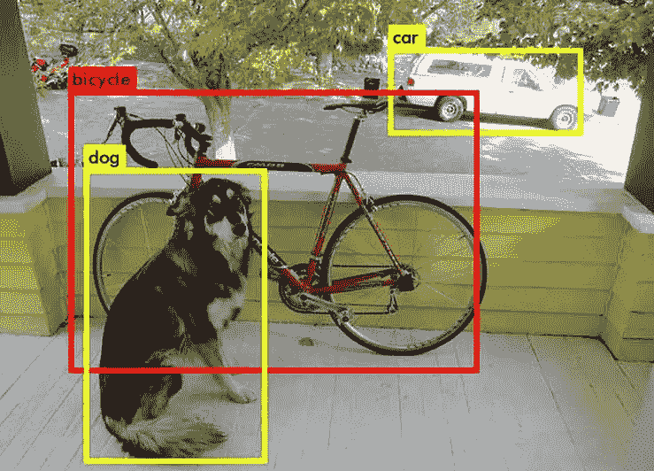

# YOLO 物体检测

> 原文：<https://medium.com/analytics-vidhya/yolo-object-detection-343a430f3b48?source=collection_archive---------3----------------------->

# 介绍

YOLO(你只看一次)是一个广泛使用的对象检测系统，由于其速度优势，最适合用于实时对象检测。它与[单次多盒检测器(SSD)](https://james-han.medium.com/ssd-single-shot-multibox-detector-86e891113896) 相似，都是在卷积网络的一次通过中预测边界盒和类别概率。这不同于其他先进的对象检测系统，如更快的 R-CNN，因为后者使用区域提议网络。

YOLO 系列的主要优势是这些系统运行速度更快，但有时与 R-CNN 系列相比，这是以较低的平均精度为代价的。

本文总结了 YOLO 系列的每个版本，并展示了它如何在多年的发展中保持作为截至 2021 年 9 月的最先进的物体探测系统之一。

# YOLOv1

对象检测问题被构造为单个回归问题，并且单个卷积网络被用于同时预测多个包围盒和类别概率。YOLO 在训练和测试期间看到整个图像，所以它使用从边界框和背景中的对象提取的特征。

图像被分成一个 *S * S* 网格，网格中的每个单元负责检测位于该单元中心的对象。每个单元格预测 *B* 边界框和物体在框中存在的可能性的置信分数。对于每个边界框，产生 5 个输出:框中心的 *(x，y)* 坐标、框的宽度和高度以及置信度得分。每个网格单元还预测 *C* 条件类概率，这意味着如果一个对象确实在盒子里，那么该对象在每个类中的概率是多少。总的来说，YOLO 模型输出一个 ***S * S * (5B + C)*** 张量。

网络架构由 24 个卷积层和 2 个全连接层组成，卷积层在 1 x 1 和 3 x 3 滤波器之间交替。一个名为“快速 YOLO”的较小网络使用 9 层卷积层，而不是 24 层，其他一切都与 YOLO 相同。

# YOLOv2 (YOLO9000)

YOLOv2 被命名为 YOLO9000，因为它能够检测超过 9000 个对象类。为了实现这一点，最大的障碍是获得足够大的标记数据集，这对于 9000 个对象类来说是非常昂贵的。因此，使用分层的对象分类结构，这使得能够使用多个不同的数据集进行训练(使得每个数据集不需要包含所有 9000 个类)，甚至使用对象分类数据集，这比对象检测数据集的获得便宜得多。

YOLOv2 的重点是在保持分类精度的同时提高 YOLO 的召回率和定位率。YOLOv2 中引入了以下方法:

**批量归一化。**通过向所有卷积层添加批量归一化，我们可以将正则化引入到模型中，并且它能够在不过度拟合的情况下移除丢失步骤。

**高分辨率分类器。**训练时，原始 YOLO 将所有输入图像的大小调整为 224 x 224，并将分辨率提高到 448 x 448，以便检测。YOLOv2 使用 448 x 448 分辨率进行训练和检测，这使得学习更加容易。

**锚箱。**yolov 2 没有使用全连通层来预测包围盒坐标，而是去除了全连通层，使用锚盒来预测偏移量而不是坐标，简化了问题，也更便于网络学习。使用锚盒还允许网络预测更多的盒子，这极大地提高了召回率，而精度仅略有下降。

**维度集群。**不是手动选取锚框，而是在训练集边界框上运行 k-means 聚类，以自动找到好的先验。

**直接位置预测。使用锚盒会引入稳定性问题:因为预测的盒不受约束，预测的偏移值会在迭代之间波动，并且需要很长时间来稳定。因此，将约束添加到位置预测中，以使网络更加稳定，学习速度更快。**

**细粒度特征。**通过将相邻要素堆叠到不同的通道而不是空间位置，添加了一个直通图层来连接较高分辨率要素和较低分辨率要素。这使得网络可以访问更细粒度的功能，以捕捉更小的细节。

**多尺度训练。**网络不是固定输入图像尺寸，而是每隔几批随机调整输入图像尺寸。这种技术允许网络在预测不同输入图像尺寸时变得更加稳健。

**暗网-19。**这种新的网络架构包括 19 个卷积层和 5 个最大池层，用于提高预测速度。

**等级分类。**一些数据集有“狗”和“人”等宽泛的类别，而其他数据集有更具体的类别，如不同品种的狗。使用类别的分层树来描述可用标记数据集中的所有类别，以便可以使用多个数据集来训练相同的分类模型。这就是 YOLOv2 能够检测 9000 多个类的原因。

# YOLOv3

YOLOv3 比 YOLOv2 有了更大的改进。这些改进包括:

**多类预测。**每个标签盒可能包含多个标签，如“狗”、“柯基”。不使用 softmax，而是使用多个独立的逻辑分类器。

**跨尺度的预测。** YOLOv3 可以预测 3 种不同比例的盒子，因此它更擅长寻找小物体，这是 YOLOv2 的一个主要缺点。

**暗网-53。**这个新的主干有 53 层卷积层，而不是 YOLOv2 使用的 Darknet-19 中的 19 层。这种改变以牺牲速度为代价提高了预测的准确性。

# YOLOv4

YOLOv4 不是由前三个 YOLO 版本的原始开发者 Joseph Redmon 开发的，由于对计算机视觉在军事应用中的应用和数据保护问题的道德关注，他停止了他的研究。

由 Bochkovskiy、王和廖开发的 YOLOv4 在 YOLOv3 的基础上提供了一些额外的改进，这些改进包括:

**CSPDarknet53。**这种新的主干基于 Darknet-53，它使用 CSPNet(跨级局部网络)策略将基础层的特征图分成两部分。一部分经过密集区块和过渡层，然后与另一部分合并，形成下一层。

**空间金字塔汇集。**通过应用大小过滤器尺寸的金字塔，这个新层有助于增加特征的感受域。

**PANet。** YOLOv4 使用 PANet(路径聚合网络)的参数聚合技术，通过自底向上的路径增强，在较低层使用精确的定位信号来增强特征层次，从而缩短层间的信息路径。