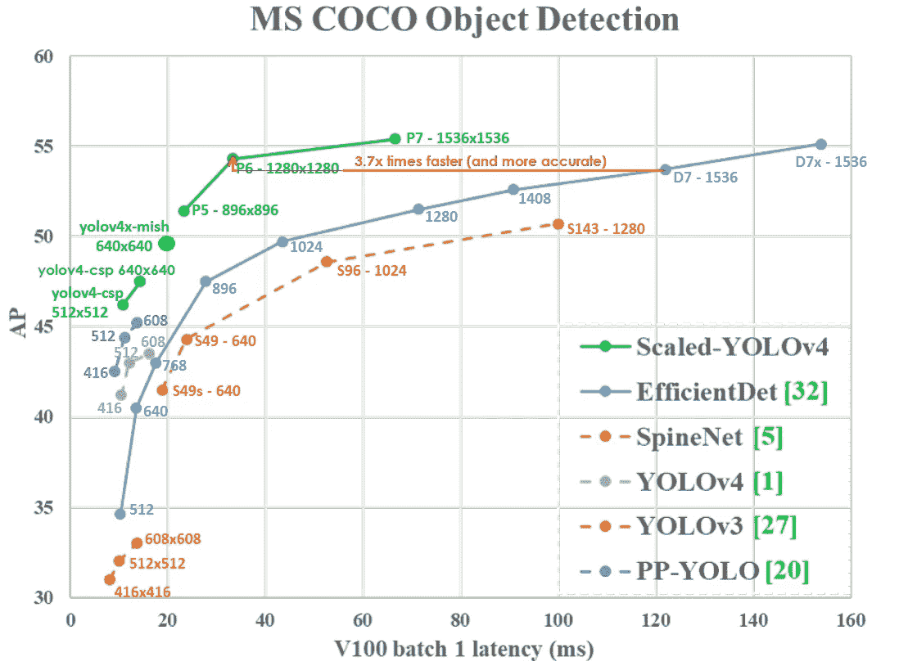
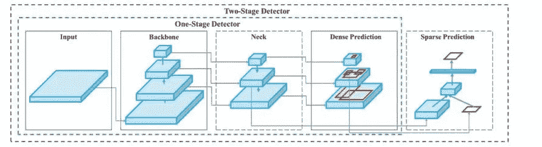
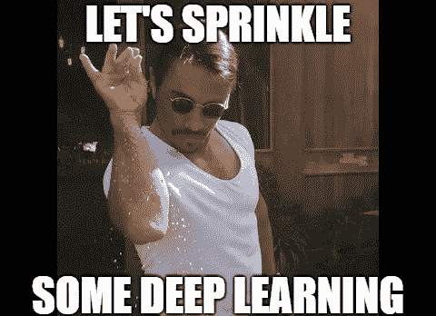

# YOLOV4:快速概述

> 原文：<https://medium.com/analytics-vidhya/yolov4-a-quick-overview-d98e29c22771?source=collection_archive---------8----------------------->

# 什么是 YOLO？

代表你只看一次的 YOLO 是一个最先进的实时对象检测系统，在 Tesla V100(用于 yolov4)上以 65 FPS 的实时速度为 MS COCO 数据集提供 43.5%的平均精度(65.7% AP50)。YOLO 背后的主要思想是提高实时对象检测的准确性，使它们不仅可以用于提示生成推荐系统，还可以用于独立的过程管理和减少人工输入。

# 与其他物体探测器有何不同？

最精确的现代神经网络不能实时运行，需要大量的 GPU 进行训练。这就是 YOLO 通过创建一个在传统 GPU 上实时运行的 CNN 来拯救的地方，实现高质量和令人信服的对象检测结果。此外，甚至可以使用单个 1080 Ti 或 2080 Ti GPU 来进行训练，以获得超快速和准确的对象检测器，从而以可承受的价格大规模使用。

# 探测器是如何工作的？

在了解 YOLOV4 之前，我们首先需要了解探测器的工作原理。现代检测器通常由两部分组成，一部分是在 ImageNet 数据集上预先训练的主干，用于提取特征，另一部分是头部，用于预测对象的类别和边界框。头部通常分为两类，即一级物体检测器和两级物体检测器。两阶段对象检测器首先使用区域提议网络来生成感兴趣区域，然后分类并生成边界框，而一阶段对象检测器通过获取输入图像并学习类别概率和边界框坐标来将其视为回归问题。对于一级物体探测器，最具代表性的型号是 YOLO，而最具代表性的两级物体探测器是 R-CNN 系列。最近，在脊椎和头部之间增加了一层，称为颈部，用于收集不同阶段的特征地图，这些地图由若干自下而上和自上而下的路径组成。该架构可以在下图中看到:

# YOLOv4 与其他早期版本有何不同？

YOLOv4 分别提高 YOLOv3 的 AP 和 FPS 10%和 12%。但是这种贡献从何而来？有大量的特征可以提高卷积神经网络(CNN)的准确性，选择了一些适用于大多数模型、任务和数据集的通用特征，并验证了其训练影响，我们称之为对象检测的免费包和特殊包方法。赠品袋(Bag-of-Freebies)是在不增加推理成本的情况下，只增加训练成本，使物体检测器获得更好的准确性的方法。数据扩充是一个这样的免费赠品的例子，它增加了输入图像的可变性，这反过来使得检测模型对于从不同环境获得的图像是鲁棒的。现在，正如人们所猜测的那样，特价商品只不过是仅少量增加推理成本但显著提高检测准确性的方法。这些模块增强了模型中的某些属性，如扩大感受野、引入注意机制或加强特征整合能力等。

最后，在 yolov4 中，CSPDarknet53 用作主干，SPP 附加模块，PANet 路径聚合用作颈部，YOLOv3(基于锚点)用作头部。此外，使用数据增强镶嵌和自我对抗训练(SAT)的新方法，其中混合镶嵌 4 个训练图像，并且计算来自每层上 4 个不同图像的激活统计。而在 SAT 中，首先改变原始图像而不是网络权重，然后训练以检测该修改图像中的对象。此外，正在修改一些现有的方法，以使设计适合于有效的训练和检测，如修改的 SAM、修改的 PAN 等。

现在，当我们对它的工作原理和该领域的最新发展有了一个简要的了解后，我们首先想到的是**我们能在哪里使用它？**应用程序层出不穷，下面列出了其中一些:

**1。面具检测** —识别不遵守适当的 covid 协议(如戴面具)的人。

**2。签名检测** —识别法律文件中是否存在签名。

**3。表格检测** —检测文件中的表格。

**4。牌照检测** —检测车辆的牌照。

**5。物体计数器** —结合跟踪算法创建行人或车辆计数器。

# 参考资料:

1.  https://arxiv.org/abs/2004.10934？

感谢阅读。如果你觉得这篇文章有用，请分享。😃

# 与我联系:

 [## Shubham Choudhary —副技术主管(NLP 工程师)— Zycus | LinkedIn

### 内心是探险家，工作中是决策科学家。我是一个非常积极的数据科学爱好者，喜欢…

www.linkedin.com](https://www.linkedin.com/in/shubham-choudhary-391942101/)