# YOLOv4 vs YOLOv4-tiny

> 原文：<https://medium.com/analytics-vidhya/yolov4-vs-yolov4-tiny-97932b6ec8ec?source=collection_archive---------1----------------------->

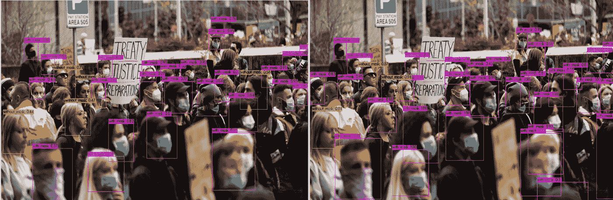

**照片由** [**米切尔罗**](https://unsplash.com/@mitchel3uo?utm_source=unsplash&utm_medium=referral&utm_content=creditCopyText) **上** [**下**](https://unsplash.com/photos/J0p6uULLZsQ?utm_source=unsplash&utm_medium=referral&utm_content=creditCopyText)

## 用于目标检测的训练 YOLO

# 什么是 YOLO？

YT14 代表**Y**ou**O**only**L**ook**O**nce。YOLO 是一个最先进的实时物体探测系统。它是由约瑟夫·雷德蒙开发的。这是一个实时对象识别系统，可以在单个帧中识别多个对象。随着时间的推移，YOLO 已经发展成更新的版本，即。、YOLOv2、YOLOv3 和 YOLOv4。

YOLO 使用了一种完全不同于以往其他探测系统的方法。它将单个神经网络应用于整个图像。该网络将图像分成多个区域，并预测每个区域的边界框和概率。这些边界框由预测概率加权。

下图展示了 YOLO 的基本思想。YOLO 将输入图像分成一个 S × S 网格，每个网格单元负责预测位于该网格单元中心的物体。

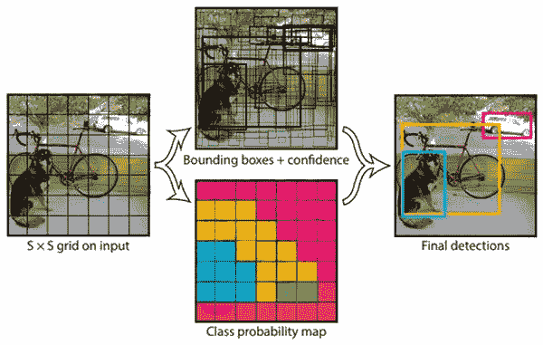

每个网格单元预测 B 边界框和这些框的置信度得分。这些置信度得分反映了模型对盒子包含对象的置信度，以及它认为盒子预测的准确性。

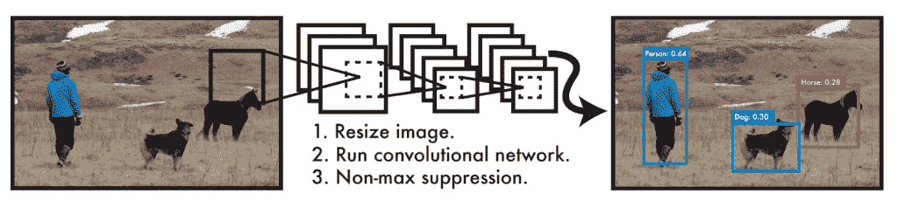

与基于分类器的系统相比，YOLO 模型有几个优点。它可以在单个帧中识别多个对象。它在测试时查看整个图像，因此它的预测是由图像中的全局上下文提供的。它还可以通过单个网络评估进行预测，不像 R-CNN 这样的系统需要成千上万的单个图像。这使得它非常快，比 R-CNN 快 1000 多倍，比快速 R-CNN 快 100 倍。YOLO 设计支持端到端训练和实时速度，同时保持较高的平均精度。

有关完整 YOLO 系统的更多详细信息，请参见以下文章。

*   [https://arxiv.org/abs/1506.02640](https://arxiv.org/abs/1506.02640)
*   [https://arxiv.org/abs/1804.02767](https://arxiv.org/abs/1804.02767)
*   [https://arxiv.org/abs/1807.05511](https://arxiv.org/abs/1807.05511)
*   [https://arxiv.org/abs/1907.09408](https://arxiv.org/abs/1907.09408)

# YOLOv4 是什么？

**YOLOv4** 是一种对象检测算法，它是由 **YOLOv3** 模型演化而来。 **YOLOv4** 方法是由 **Alexey Bochkovskiy** 、**钱-王尧**和**洪元标廖**创造的。在性能相当的情况下，它的速度是 EfficientDet 的两倍。此外， **YOLOv4** 中的 **AP** (平均精度)和 **FPS** (每秒帧数)比 **YOLOv3** 分别增加了 **10%** 和 **12%** 。 **YOLOv4** 的架构由 CSPDarknet53 作为主干，空间金字塔池附加模块，PANet 路径聚合颈，和 **YOLOv3** 头组成。

**YOLOv4** 使用了许多新功能，并结合了其中的一些功能来实现最先进的结果:**43.5% AP**(**65.7% AP50**)对于 **MS COCO** 数据集，在 **Tesla V100** 上的实时速度为 **~65 FPS** 。以下是 **YOLOv4** 使用的新功能:

*   ***【WRC】***
*   ***【跨阶段部分连接】***
*   ***交叉小批量标准化***
*   ***【SAT】***
*   ***Mish 激活***
*   ***镶嵌数据增强***
*   ***DropBlock 正则化***
*   ***完全交集超过并集损失(CIoU loss)***

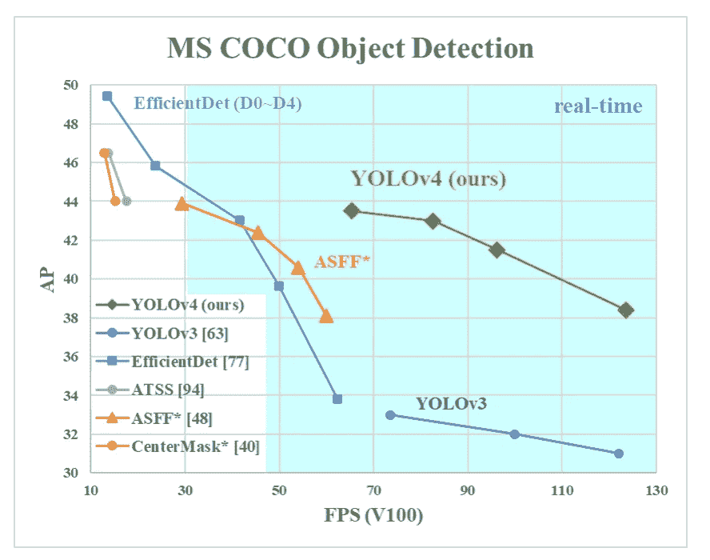

# 什么是 YOLOv4-tiny？

**YOLOv4-tiny** 是 **YOLOv4 的压缩版。****是在 YOLOv4 的基础上提出的，目的是使网络结构更简单，参数更少，使其在移动和嵌入式设备上开发变得可行。**

**我们可以使用 YOLOv4-tiny 进行更快的训练和更快的检测。它只有两个 YOLO 头，而不是 YOLOv4 中的三个，并且它已经从 29 个预训练的卷积层中****训练，而不是 YOLOv4 已经从 137 个预训练的卷积层中训练。******

******YOLOv4-tiny 中的 **FPS** (每秒帧数)大约是 YOLOv4 的八倍。然而，在 MS COCO 数据集上测试时，YOLOv4-tiny 的**精度**是 YOLOv4 的 2/3。******

****YOLOv4-tiny 模型在 RTX 2080Ti 上以 443 FPS 的速度实现了 **22.0% AP (42.0% AP50)** ，而通过使用 TensorRT，batch size = 4 和 FP16-precision，YOLOv4-tiny 实现了 1774 FPS。****

****对于**实时对象检测**， **YOLOv4-tiny** 与 **YOLOv4** 相比是更好的选择，因为在使用实时对象检测环境时，更快的推理时间比精度或准确度更重要。****

****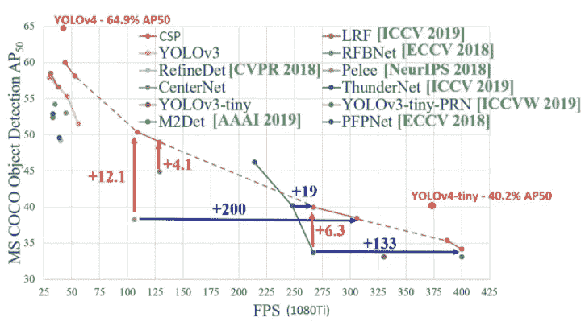****

# ******YOLOv4 定制物体检测器 vs yolov 4-微型定制物体检测器******

## ****面罩检测****

****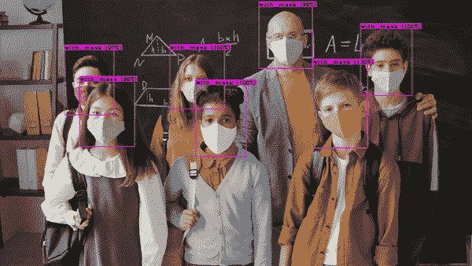****

****来自 [Pexels](https://www.pexels.com/photo/a-teacher-and-his-students-wearing-a-face-mask-while-looking-at-the-camera-5199637/?utm_content=attributionCopyText&utm_medium=referral&utm_source=pexels) 的 [Max Fischer](https://www.pexels.com/@max-fischer?utm_content=attributionCopyText&utm_medium=referral&utm_source=pexels) 的原始视频****

****我在相同的 1500 图像掩模数据集上训练了 **YOLOv4** 和 **YOLOv4-tiny** 检测器，其中 **YOLOv4** 平均损耗在 6000 次迭代后达到约 0.68，而 **YOLOv4-tiny** 平均损耗在 6000 次迭代后达到约 0.15。****

> ****对于一个好的探测器模型，平均损耗应该在 0.05 到 0.3 之间。****

****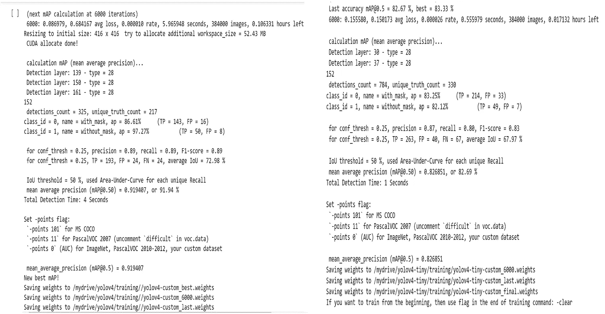****

****约洛夫 4 号..…………………………………………….. **YOLOv4-tiny******

# ****测试经过培训的定制检测器****

****当使用网络摄像头进行实时对象检测测试时，YOLOv4-tiny 比 YOLOv4 更好，因为它的推理时间快得多。然而，当在图像和视频上测试时，YOLOv4 比 YOLOv4-tiny 更有效。****

# ****在图像上测试探测器****

****我在相同的图像上运行了两个训练过的探测器。在下面并排看到它们的输出，左边是**yolov 4-tiny**预测图像，右边是**yolov 4**预测图像。****

## ****yolov 4-tiny ~ ~ ~ ~ ~ ~ ~ ~ ~ ~ ~ ~ ~ ~ ~ ~ ~ ~ ~ ~ ~ ~ ~ ~ ~ ~ ~ ~ ~ ~ ~ ~ ~ ~ ~ ~ ~ ~ ~ ~ ~ ~ ~ ~ ~ ~ ~ ~ ~ ~ yolov 4****

****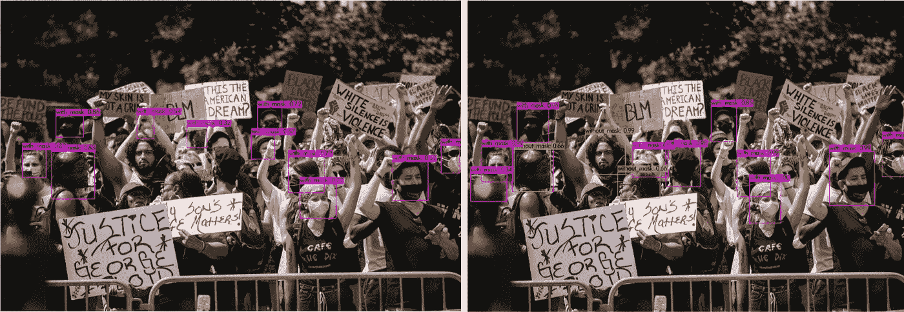****

****原始照片由[生活要紧](https://www.pexels.com/@life-matters-3043471?utm_content=attributionCopyText&utm_medium=referral&utm_source=pexels)发自 [Pexels](https://www.pexels.com/photo/crowd-of-protesters-holding-signs-4614165/?utm_content=attributionCopyText&utm_medium=referral&utm_source=pexels)****

********

****由[拍摄的原始照片](https://www.pexels.com/@life-matters-3043471?utm_content=attributionCopyText&utm_medium=referral&utm_source=pexels)来自 [Pexels](https://www.pexels.com/photo/women-holding-signs-in-protest-4613917/?utm_content=attributionCopyText&utm_medium=referral&utm_source=pexels)****

****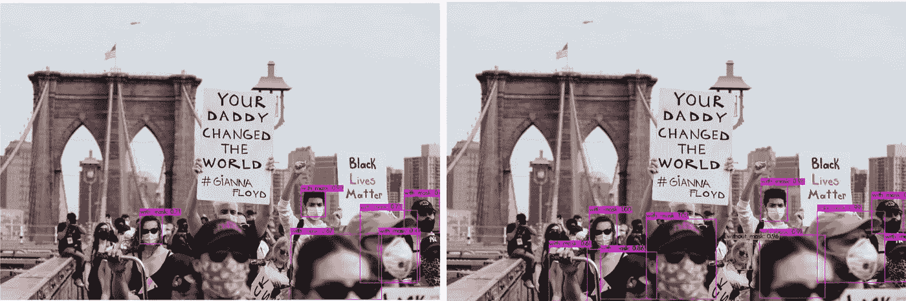****

****来自 [Pexels](https://www.pexels.com/photo/women-holding-signs-in-protest-4613917/?utm_content=attributionCopyText&utm_medium=referral&utm_source=pexels) 的 [Life Matters](https://www.pexels.com/@life-matters-3043471?utm_content=attributionCopyText&utm_medium=referral&utm_source=pexels) 原图****

****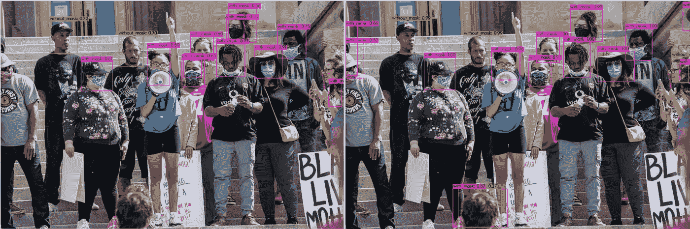****

****来自 [Pexels](https://www.pexels.com/photo/group-of-people-with-masks-protesting-on-street-5382987/?utm_content=attributionCopyText&utm_medium=referral&utm_source=pexels) 的 [Brett Sayles](https://www.pexels.com/@brett-sayles?utm_content=attributionCopyText&utm_medium=referral&utm_source=pexels) 的原始照片****

****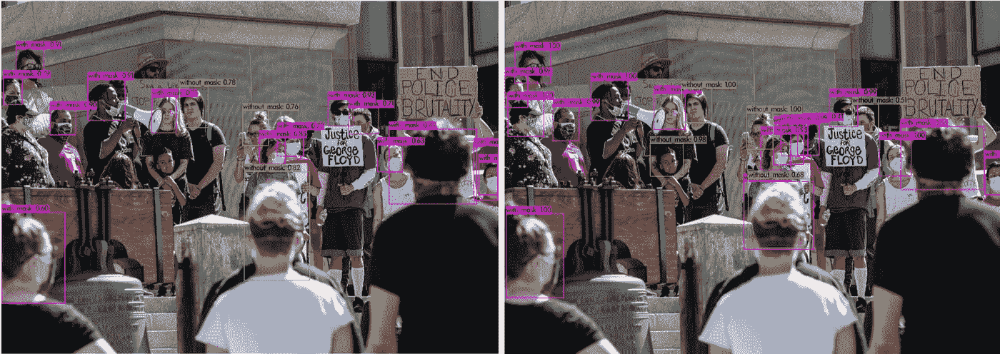****

****来自 [Pexels](https://www.pexels.com/photo/group-of-protesting-people-standing-on-street-5408003/?utm_content=attributionCopyText&utm_medium=referral&utm_source=pexels) 的 [Brett Sayles](https://www.pexels.com/@brett-sayles?utm_content=attributionCopyText&utm_medium=referral&utm_source=pexels) 的原始照片****

# ****在视频上测试探测器****

****我还在相同的视频上运行了两个探测器。你可以在下面看到他们的视频对比。****

# ****我的自定义掩膜数据集****

****我在下面的链接中分享了我的标注掩膜数据集。这是一个相对较小的数据集，但它将为您如何使用 YOLO 训练您自己的自定义检测器模型提供一个良好的开端。您可以找到具有更高质量图像的更大数据集，并在以后自己标记它们。****

****[https://www . ka ggle . com/techzizou/labelled-mask-dataset-yolo-darknet](https://www.kaggle.com/techzizou/labeled-mask-dataset-yolo-darknet)****

*******obj.zip*** 文件包含 1510 张图像以及它们的 YOLO 格式标签文本文件。我已经标记了大约 1350 张，并从 Roboflow 下载了 149 张带标签的图片。****

******注意:**这个数据集大部分是特写图像(1300 左右)，很少是远景图像(200 左右)。如果你想下载更多的长镜头图像，你可以在网上搜索数据集。有很多网站可以找到更多的数据集。我在底部的[数据集来源](https://medium.com/p/97932b6ec8ec/edit#e5ee)下给出了几个链接。您还可以将自己的图像及其 YOLO 格式的标签文本文件添加到数据集中。****

****由于我的数据集大部分都是特写图像，所以对图像和视频中特写的检测非常好。另一方面，只有 200 个远景图像给了我们远景检测的平均性能。****

****这表明收集数据集并正确标记它们的过程是多么重要。永远记住这条规则:- **垃圾入=垃圾出**。选择和标记图像是最重要的部分。尽量找质量好的图片。数据的质量在很大程度上决定了结果的质量。****

# ****查看以下媒体文章，了解如何使用**yolov 4**Y**olo v4-tiny**训练您的自定义对象检测器****

## ****自定义 YOLOv4 培训教程****

 ****[## 中等

训练 YOLOv4 自定义对象检测器(使用 Google Colab)](/@techzizou007/training-a-custom-detector-for-mask-detection-using-yolov4-darknet-using-google-colab-61a659d4868)**** 

******定制 YOLOv4-tiny 训练教程******

 ****[## 中等

训练一个 yolov 4-微型自定义对象检测器(使用 Google Colab)](/@techzizou007/training-a-custom-detector-for-mask-detection-using-yolov4-tiny-darknet-using-google-colab-b58be08c9593)**** 

# ****如果你觉得这篇文章有帮助，请订阅我的 YouTube 频道或考虑在帕特里翁/ BuyMeACoffee🖖上支持我****

 ****[## 给我买杯咖啡！

### 嘿，👋我正在创建技术博客和视频。你现在可以给我买杯咖啡来支持我的频道了！

www.buymeacoffee.com/techzizou](https://www.buymeacoffee.com/techzizou)****  ****[## 订阅模式

### Patreon 正在为新一代创作者赋能。支持和参与艺术家和创作者，因为他们活出自己的…

www.patreon.com/techzizou](https://www.patreon.com/techzizou)**** 

# ****信用****

## ****参考****

*   ****[pjreddie Github](https://github.com/pjreddie/darknet)****
*   ****[pjreddie 站点](https://pjreddie.com/darknet/yolo/)****
*   ****阿列克谢·阿布·吉图布****
*   ****[https://arxiv.org/abs/1506.02640](https://arxiv.org/abs/1506.02640)****
*   ****[https://arxiv.org/abs/1804.02767](https://arxiv.org/abs/1804.02767)****
*   ****[https://arxiv.org/abs/1807.05511](https://arxiv.org/abs/1807.05511)****
*   ****[https://arxiv.org/abs/1907.09408](https://arxiv.org/abs/1907.09408)****
*   ****https://arxiv.org/abs/2004.10934****
*   ****【https://arxiv.org/abs/2011.08036 ****

## ****数据集源****

****您可以从下面提到的网站下载许多对象的数据集。这些网站还包含许多种类的对象的图像以及它们的多种格式的注释/标签，例如 YOLO _ 黑暗网文本文件和帕斯卡 _VOC xml 文件。****

*   ****[通过谷歌打开图像数据集](https://storage.googleapis.com/openimages/web/index.html\)****
*   ****[Kaggle 数据集](https://www.kaggle.com/datasets)****
*   ****[Roboflow 公共数据集](https://public.roboflow.com/)****
*   ****[可视化数据数据集](https://www.visualdata.io/discovery)****

## ****屏蔽数据集源****

****我将这 3 个数据集用于我的标记数据集:****

*   ****[般若 Github](https://github.com/prajnasb/observations)****
*   ****约瑟夫·纳尔逊·罗博弗洛****
*   ****[X-张洋 Github](https://github.com/X-zhangyang/Real-World-Masked-Face-Dataset)****

****更多掩膜数据集****

*   ****Prasoonkottarathil ka ggle(20000 张图片)****
*   ****[ashishjangra 27 ka ggle](https://www.kaggle.com/ashishjangra27/face-mask-12k-images-dataset?select=Face+Mask+Dataset)(12000 张图片)****
*   ****[安德鲁·默德·卡格尔](https://www.kaggle.com/andrewmvd/face-mask-detection)****

## ****视频源****

*   ****[https://www.pexels.com/](https://www.pexels.com/)****

## ****别忘了留下👏****

## ****祝您愉快！！！✌****

## ****♕·特奇佐·♕****