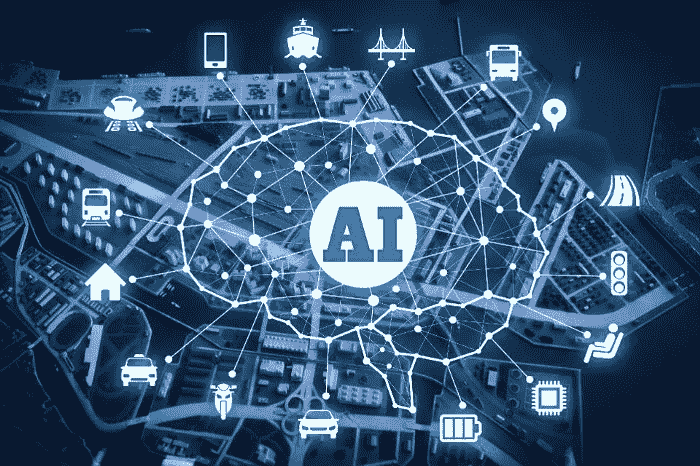

# 你、我、人工智能和人工智能——技术趋势和应用

> 原文：<https://medium.com/analytics-vidhya/you-i-ai-ml-technology-trends-and-applications-b47d9059d0bf?source=collection_archive---------10----------------------->

人工智能和机器学习相关的概念、应用触及到我们日常生活的每一个部分。

人工智能在日常生活中的应用。参考:[链接](/widgetlabs/10-uses-of-ai-in-your-everyday-life-5ebfbf310157)

你的智能手机使用人工智能来理解人类语言，回答问题或响应你的命令，但人工智能的潜力不止于此。苹果推出了名为 **SIRI** 的人工智能软件，世界上很少有人理解它的主流意义，因此它没有立即流行起来，也是由于基于人工智能的事实，它需要学习和进化，这需要时间。然而，从那以后，不仅苹果显著改进了 Siri，世界各地的消费者也开始依赖它来完成日常任务，从组织日常工作到安排正式会议和其他活动。

Siri 的成功导致谷歌等其他手机和操作系统制造商也以谷歌助手的形式提出了这种解决方案。

以下是基于人工智能、人工智能的应用，我们许多人已经在使用或在不久的将来会遇到这些应用，它们将使我们的生活变得极其方便。

1.  **AI &机器学习供电闹钟**
2.  **家庭安全系统**
3.  **房屋清洁系统**
4.  **杂货和电子商务购物**
5.  **健康与健身**
6.  **运输**
7.  **社交媒体平台**
8.  **银行和金融**
9.  **农业**
10.  **制造业**

# 1.人工智能和机器学习驱动的闹钟

谷歌为谷歌助手引入了一项新功能，这将使唤醒变得更加容易。为了生成个性化的闹钟提醒，数字代理将使用机器学习程序和用户位置数据。虽然目前只能在一台计算机上访问，但它可能会成为一种无处不在的生产力资源。此外，谷歌透露其正在开发下一代流媒体设备，该设备具有一些吸引人的技术规格。

该公司的新谷歌助手功能称为即兴，它与开源机器学习音乐程序 Magenta 一起工作。在用户创建闹钟提醒后，数字代理将与人工智能(AI)程序进行交互。具体来说，它会告诉音乐应用程序它的主人什么时候需要醒来，以及他们所在地区的天气。利用这些数据，Magenta 将制作一个原创作品，以满足用户的唤醒需求。理论上，该程序的定制铃声将比传统的闹铃声音更少刺耳和恼人。事实上，这部电影舒缓的音乐比嘈杂的电子声音更令人愉快。此外，即兴乐队源源不断的新歌将减少人们醒来时总是听到同一个音调的烦恼。

目前，该程序仅适用于联想的智能时钟和谷歌助手。但由于该功能是谷歌广泛可用的数字代理的一部分，该公司可能会在未来将它添加到许多产品中。

带谷歌助手的联想智能时钟

# 2.家庭安全系统

基于人工智能的家庭安全系统和物联网技术的融合也产生了一种新型的家庭安全系统。尽管取得了所有这些进步，但专家认为，人工智能可以在提供更高的安全水平和在家放松方面做出更大的贡献。

目前，人工智能在家庭安全系统中以两种方式使用。

**首先是**，在集成了它的摄像机系统中。人工智能在这些相机中被用作面部识别的工具**。这有助于确定房屋中的任何移动是否是由房屋成员或侵入者引起的。在这种情况下，面部识别的功能充当非常基本类型的机器学习的示例，其中照片的集合被上传到系统中，并且系统使用这些图像来警告房屋所有者，以防进入房屋的人的面部特征与上传的照片不匹配。**

**其次**，人工智能在家庭安防系统中作为**语音助手**。这允许系统中用户可以向安全系统发送语音命令以及查询安全状态和其他细节。各种人工智能技术用于产生语音助手中所需的技能，以使其对用户友好，并确保设备和用户之间的通信是无缝的。

由于越来越多的家庭自动化设备与家庭安全系统合并，因此可以在人工智能的帮助下创建真正的智能家庭，其中系统在没有用户参与的情况下独立执行。这大大有助于减轻房主的整体压力水平，因此，当这个人在家或不在家时，会增加舒适感。

Simcam AI 安全

# 3.房屋清洁系统

在过去的十年里，清洁机器人的能力有了很大的提高。事实上，该市场上的一些高端产品目前已经进入第六代。原始设备制造商越来越多地寻求采用人工智能技术，特别是在真空清洁、地板清洁和草坪修剪等杂务方面。以下是一些目前可用的清洁机器人。

iRobot Roomba :当 iRobot 在 2002 年推出其第一款机器人吸尘器 Roomba 时，该产品已经具备了相当基本的人工智能能力，例如使用内置传感器识别墙壁和避开楼梯。Roomba 的最新 980 型号具有先进的决策能力，由人工智能提供动力。机器人能够扫描房间大小，识别障碍，并记住最有效的路线和方法。

下面的视频简要介绍了该产品及其功能:

IRobot Roomba

**RX-V100** 是一款嵌入了语音识别人工智能引擎的清洁机器人，可以通过闪烁的灯光和语音信息的组合来报告机器人的当前状态等任务。例如，当用户向机器人发出语音命令“清洁”时，RX-V100 会使用人工智能语音来回复“好吧”，并“摇摆”以确认该命令。然后，它开始在自动模式下清洗。除此之外，该产品还带有一组预定义的消息和响应，以模拟简单的对话，如“早上好”或“最近怎么样？”

展示 RX-V100 型号部分功能的视频:

基于语音的 Cocorobo 真空吸尘器

**ROXXTER** 博世推出了其 ROXXTER 系列机器人吸尘器，利用人工智能绘制环境的交互式地图。这些机器人被配备为通过亚马逊的 Alexa 助手兼容设备处理语音命令。例如，用户可以通过命令 Alexa 来激活 Roxxter 机器人:“Alexa，将 Home Connect 机器人真空搬到客厅。”

视频展示了 ROXXTER 型号的一些功能:

博世洛克斯特

# 4.杂货和电子商务购物

特别是对于杂货商来说，人工智能的预测能力可能在预测库存需求、根据内部和外部因素确定产品价格、分析客户行为、预防损失、交付服务等方面发挥重要作用。对于购物者来说，人工智能可以提供一定程度的便利，类似于亚马逊 Go 体验。

人工智能应用程序的主要群体可用于食品杂货和电子商务行业。

1.  存货管理
2.  防盗
3.  营销和推广
4.  减少食物浪费
5.  改善客户体验
6.  通过识别趋势和建议提高运营效率

自主杂货店购物

基于计算机视觉、人工智能和机器学习的亚马逊 go 商店

# 5.健康和健身

人工智能和机器学习的影响是如此之大，以至于它完全改变了医疗保健部门和健身行业的护理服务。临床数据表明，人工智能正在简化医生、医院管理者和患者的生活。它有助于执行通常由人类完成的任务，但时间和成本更少。使用人工智能可以实时跟踪各种健康机器。深度学习技术的一个主要趋势是检测早期癌症的能力。人工智能技术有助于培训放射科医生，提高他们的表现。在消费者健康应用中，它收集数据并处理信息，以根据患者的生活方式进行调整。

多年来，人工智能已经成为健康和健身行业的重要组成部分。用于健身的人工智能解决方案已经彻底改变了这个行业。人工智能现在专注于重塑人们的个人习惯。AI 可以轻松地帮助跟踪健身房中的健康行为和重复运动模式。然后它会帮助你使用这些数据来指导你实现你的健身目标。人工智能和机器学习解决方案与您的智能手机和智能手表相连，为您提供准确的结果。AI in fitness 旨在让消费者更健康、更聪明。

微软人工智能促进健康

人工智能驱动的家庭健身房

# 6.运输

交通领域开始将人工智能(AI)应用于任务关键型任务(例如，载有乘客的自动驾驶汽车)，其中人工智能系统的可靠性和安全性将受到公众的质疑。运输行业的主要挑战，如容量问题、安全、可靠性、环境污染和浪费的能源，为人工智能创新提供了充足的机会(和高 ROI 的潜力)。

LTE、5G 和 LPWAN 等高端商用 CPU、GPU 和物联网通信技术为大数据和人工智能在交通领域的多种应用创造了可能性。

IBM Watson:基于人工智能的自动驾驶汽车解决方案

# 7.社交媒体平台

人工智能是你每天使用的流行社交网络的关键组成部分。脸书使用先进的机器学习来做一切事情，从为你服务内容到在照片中识别你的脸，再到用广告瞄准用户。Instagram(归脸书所有)使用人工智能来识别视觉效果。LinkedIn 使用人工智能来提供工作建议，建议你可能想联系的人，并在你的订阅源中为你提供特定的帖子。

这些只是人工智能如何在幕后为世界上最受欢迎的社交网络的功能提供动力的几个例子。而且，在所有社交媒体平台上，人工智能和机器学习正在规范你创建的内容和你购买的广告如何呈现在用户面前——通常是以对营销人员不完全透明的方式。

如今，各大品牌正在部署人工智能工具，以:

*   创建社交媒体帖子。
*   弄清楚什么帖子效果最好。
*   衡量社交平台的品牌和趋势。
*   销售和营销
*   写社交广告。
*   减少跨平台的管理时间和成本。

由人工智能驱动的社交媒体平台

# 8.银行和金融

人工智能是银行业的未来，因为它带来了先进的数据分析能力，可以打击欺诈性交易并提高合规性。人工智能算法在几秒钟内完成反洗钱活动，否则需要几个小时甚至几天。人工智能还使银行能够以创纪录的速度管理海量数据，从中获得有价值的见解。人工智能机器人、数字支付顾问和生物识别欺诈检测机制等功能可以为更广泛的客户群提供更高质量的服务。所有这些都转化为收入增加、成本降低和利润增加。

# 9.农业

农业和耕作是世界上最古老和最重要的职业之一。它在经济领域发挥着重要作用。在世界范围内，农业是一个价值 5 万亿美元的产业。

到 2050 年，全球人口预计将超过 90 亿，这将需要农业产量增加 70%才能满足需求。随着世界人口的增长，土地、水和资源变得不足以维持供需链。因此，我们需要一个更聪明的方法，变得更有效率，更有效率。

## 人工智能在农业中的应用:

1.  天气预报
2.  土壤和作物健康监测系统
3.  通过无人机分析作物健康状况
4.  精准农业和预测分析
5.  农业机器人
6.  人工智能系统检测害虫
7.  基于未来需求的农民作物管理
8.  提高收割质量
9.  水管理
10.  管理和预测作物价格波动

EY 和微软基于人工智能的解决方案

# 10.制造业

制造业一直对采用新技术持开放态度。制造商经常面临不同的挑战，例如意外的机械故障或有缺陷的产品交付。利用人工智能和机器学习，制造商可以提高运营效率，推出新产品，定制产品设计，并规划未来的财务行动，以推进他们的人工智能数字化转型。

受欢迎的原因是，制造业数据非常适合人工智能/机器学习。制造业充满了机器更容易分析的分析数据。数百个变量影响着生产过程，尽管人类很难分析这些变量，但机器学习模型可以轻松预测单个变量对复杂场景的影响。

人工智能在制造业中的应用如下:

1.  改进产品开发
2.  基于虚拟验证结果构建原型
3.  设计最优化
4.  预测性维护
5.  设备布置
6.  质量和检验
7.  物流
8.  工厂事故的预防
9.  改善工厂的健康和安全
10.  原材料价格预测
11.  优化物流和供应链
12.  流程优化以减少周期时间和成本

Tech Mahindra 的人工智能电力工业 4.0

制造业中的人工智能 Grad4 的优势

# 结论:

人工智能和机器学习正以更快的速度普及，影响着我们的生活方式。人工智能正在以这样或那样的方式影响我们的选择和生活。

还有很多使用 AI 和 ML 的领域可能本文还没有提到。随着更多的开发、改进和治理，未来几年还会有更多的事情发生。

我希望这篇文章对你学习和了解人工智能在我们的日常生活中是如何有用是有益的。

通过 [Linkedin](https://www.linkedin.com/in/sureshhp/) 和 [Medium](https://hpsuresh12345.medium.com/about) 与我联系，获取新文章和博客。

— — — * — — — * — — — * — — — * — — — * — — — * — — — * —

*“培养学习的热情。如果你这样做了，你将永远不会停止成长”*

— — — * — — — * — — — * — — — * — — — * — — — * — — — * —