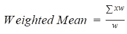

# 你的 5 分钟集中趋势指南

> 原文：<https://medium.com/analytics-vidhya/your-5-minute-guide-to-central-tendency-3277ebeca2d6?source=collection_archive---------19----------------------->

**【用简单的 Python 实现！]**

在统计学中，集中趋势(或位置的度量)是概率分布系统的中心点或典型度量。目标是提供整个数据的准确表示。收集的数据的单个值是分布的最典型或最有代表性的值。

通俗地说，集中趋势法也被称为平均值。集中趋势这个词可以追溯到 20 世纪 20 年代末。

平均值、中间值和众数是三个最广泛使用的衡量标准；也可以定期提及加权平均值。我们将逐一讨论其中的每一个，然后探究它们何时适用。

# 平均

平均值是算术平均值(算术平均数)，它可能是最常见的集中趋势估计值。将所有值相加，然后除以数据集中的观察次数:

意思是

您可以使用计算平均值。mean() NumPy 函数:

> 将 numpy 作为 np 导入
> 
> 数字列表= [45，34，10，36，12，6，80]
> 
> ar_mean = np.mean(num_list)
> 
> 打印(ar _ 均值)

**输出:**

> 31.857142857142858

statistics.mean()和 mean()函数返回与相同的结果。NumPy 的 mean()方法。

**要点记:**

*   平均值适用于区间和比率数据
*   它不适用于名义数据或序数数据
*   它受数据集中每个值的影响，包括极值。

# 加权平均数

有时我们希望对数字进行平均，但我们希望给一些数字增加更多的值或权重。在加权平均法中，一些数据根据目标被赋予较高(或较低)的权重。因此，加权平均值也称为加权算术平均值或加权平均数，是算术平均值的推广，有助于您定义每个数据点对结果的相对贡献。

加权平均数

其中 x 是数据值，w 是分配给数据值的权重。对所有数据值求和。通过将 sum()与 range()合并，可以在纯 Python 中实现加权平均值:

> x = [8.0，11，2.7，4，24.0]
> 
> w = [0.6，0.2，0.11，0.24，0.15]
> 
> wmean = sum(w[I]* x[I]for I in range(len(x)))/sum(w)
> 
> 打印(wmean)

**输出:**

> 9.120769230769232

# 中位数

中位数是人们大量使用的集中趋势的第二个指标，它比平均值更容易识别。对于以升序或降序排列的数据集合，中位数是中间值。

**第一步:**

*   将观察值排列成有序的阵列
*   如果有奇数个项，则中位数是有序序列的中间项。
*   如果有偶数项，中间两项的平均值就是中值

**第二步:**

*   中位数的位置由有序数组中的(n+1)/2 给出。

以下是中间值的许多可能的纯 Python 实现之一:

> 将 numpy 作为 np 导入
> 
> y=[34，67，89，12，15，3]
> 
> median_ = np.median(y)
> 
> 打印(中位数 _)

**输出:**

> 24.5

您可以使用 statistics.median()和 np.median()获得相同的值。

**要点记:**

*   适用于序数、间隔和比率
*   不适用于标称数据
*   不受非常大和非常小的值的影响

# 方式

Mode 是数据集中出现频率最高的值。一个数据集可以有一种模式、多种模式，或者根本没有模式。如果没有这种单一的值，那么这个集合就是多模态的，因为它有许多模态值。

您可以通过 [statistics.mode()](https://docs.python.org/3/library/statistics.html#statistics.mode) 获得模式:

> 进口统计
> 
> u = [2，3，2，8，12]
> 
> mode_ =统计数据. mode(u)
> 
> 打印(模式 _)

**输出:**

> 2

**要点记住:**

*   适用于所有级别的数据测量(名义值、序数、比率和区间)