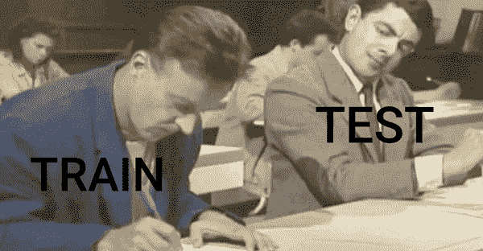

# 你的模型的度量并不总是正确的

> 原文：<https://medium.com/analytics-vidhya/your-models-metrics-isnt-always-correct-fba4768336fa?source=collection_archive---------3----------------------->

## 因此，你有关于你想用 ML 解决的问题的数据，你继续清理它，然后在它上面建立模型，对于你所有的努力，你得到了令人敬畏的度量值，你对此感到高兴，对于所有的努力，我也会感到高兴，直到我理解了这个非常厚脸皮和隐藏的数据泄漏的概念，我真的希望我早点知道这一点。

> ***对那良好的准确性感到高兴？***

故事从一个议程开始，我们必须创建一个模型，这个模型可以很好地概括“看不见的”数据，我说的“看不见”就是看不见。但是，当我们将数据分为训练和测试数据时，在所有这些令人惊叹的 EDA 之后，凭良心说，我们可能会被欺骗，认为我们的模型可以很好地概括看不见的数据(*测试数据*)，但不知不觉地，在一些技术中存在缺陷，导致数据泄漏，我们实现的准确性可能是一个错误的指导，即我们的模型可以很好地概括。

> ***数据泄露的可能领域***

考虑这种常见的情况，您有缺失值，您想要估算它们，因此您决定用平均值、中值或众数估算它们，但是在这样做时，请注意相同的平均值， 中位数或众数是在考虑整个数据集的情况下计算的，因此，当您要估算缺失值并随后将数据集分为训练和测试时，数据中已经存在污染，其中测试数据明显共享训练数据的信息(*缺失值是用某个值估算的，该值是在考虑所有数据*的情况下计算的)。

另一个可能发生泄漏的地方是，在标准化/规范化数据时，考虑到所有数据，数据被标准化/规范化，随后我们将标准化/规范化的数据分成训练和测试，但信息是共享的，污染已经发生，测试数据不再“看不见”，因此模型在测试数据上表现良好，为我们提供了更高的指标。

> ***如何避免数据泄露？***

避免这种情况需要在理解培训和测试时需要完全不同的数据方面有一定的成熟度，在 EDA 过程中有一些好的实践可以遵循，以确保没有或很少的数据泄漏。

1.  **事先将整个数据分割成训练和测试数据。**

2.**使用所有 EDA 步骤创建管道或用户定义的函数，并将它们分别应用于训练和测试数据**(例如，训练数据的平均值/中值/众数仅用于估算训练数据的缺失值，测试数据也是如此。)

**3。使用 k 倍交叉验证技术。**

所有这些都是关于什么是数据泄露以及如何避免数据泄露的简要想法，一般来说，作为初学者，这不是需要关注的领域，但这也是至关重要的，理解并遵循上述实践可能会让我们获得更合理、更一般化的模型，这些模型与真实世界的情况更相似。

希望这是翔实的，谢谢！🙏🏻