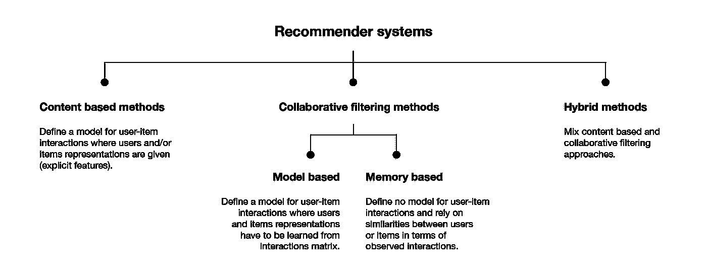
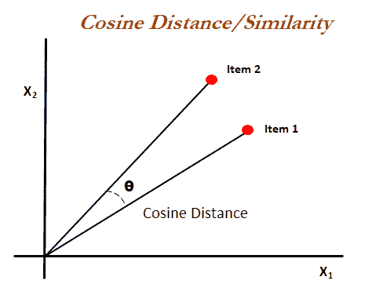
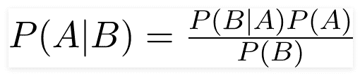
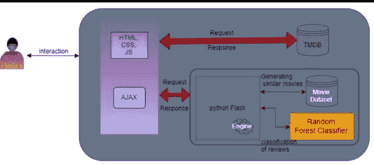
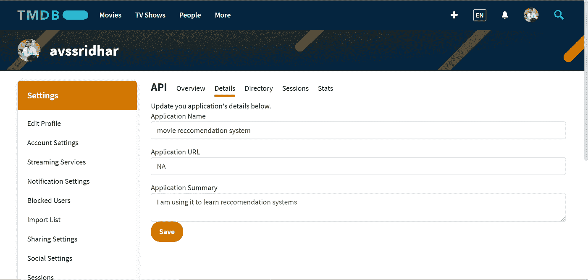

# 基于 ML 的电影推荐系统

> 原文：<https://medium.com/analytics-vidhya/your-movie-partner-ml-based-movie-recommendation-system-75aeaffbf7fc?source=collection_archive---------11----------------------->

最近，我开发了一个名为“你的电影伙伴”的应用程序，它使用基于内容的过滤来推荐电影，并将 TMDB 网站上的观众评论分为正面或负面。

下面是该项目的详细说明。

# **项目目的**

我们印度人喜欢电影。我们花了很多时间和金钱在电影提供给我们的娱乐上。自从 OTT 平台出现以来，人们对电影的喜爱与日俱增。

2017 年，OTT 平台已经创造了 2019 亿卢比的收入，到 2022 年，预计收入将达到 6000 亿卢比。现在，OTT 所有者有责任让这种体验变得更好。一种方法是推荐用户可能感兴趣的电影。像亚马逊、网飞这样的巨头已经在这么做了。

这个项目的目的是建立一个使用人工智能的电影推荐系统，并建立一个可供电影爱好者使用的功能网站。

# **简介**

这个应用程序主要有两个特点

1.基于用户搜索的电影向用户推荐电影。

2.在 TMBD 网站上对消费者搜索的电影进行正面和负面分类

**1。基于用户搜索到的电影向用户推荐电影**

推荐系统是人工智能的强大应用之一。下面是推荐引擎的一些应用。

1.像亚马逊、flipkart 这样的电子商务巨头使用推荐引擎来显示用户最终可能购买的产品。

2.Instagram、facebook、Youtube 等社交媒体平台利用你的活动，试图展示帖子，让你留在平台上

3.像亚马逊 prime、网飞这样的 OTT 平台使用自己的公式来推荐用户可能喜欢的电影。

因此，可以肯定的是，推荐系统将有助于用户体验，它们肯定有一个美好的未来。我们可以通过许多方式向用户推荐。事实上，每个公司都有自己的做法。

推荐系统的类型

在这个项目中，我们使用基于内容的相似性向用户推荐电影。然而，在上面给出的参考链接中解释了各种其他方法。

基于内容的过滤是一种机器学习技术，它使用特征的相似性来做出决策。这种技术经常用于推荐系统，推荐系统是一种算法，旨在根据用户积累的知识向用户广告或推荐东西。

它是如何决定哪个物品与用户喜欢的物品最相似的？

有各种方法可以找到电影之间的相似之处。让我们检查两者，并找到一个可以在我们的应用程序中使用

**相似度得分。**

它是一个介于 0 到 1 之间的数值范围，有助于确定两个项目在 0 到 1 的范围内有多相似。该相似性得分是通过测量两个项目的文本细节之间的相似性来获得的。因此，相似性得分是两个项目的给定文本细节之间的相似性的度量。这可以通过余弦相似性来完成。

**余弦相似度**

余弦相似性是一种度量标准，用于衡量文档的相似程度，而不考虑文档的大小。在数学上，它测量的是在多维空间中投影的两个向量之间的角度余弦。余弦相似性是有利的，因为即使两个相似的文档相距欧几里德距离很远(由于文档的大小)，它们仍有可能更靠近在一起。角度越小，余弦相似度越高。

**莱文斯坦距离**

Levenshtein 距离是用于测量两个序列之间差异的字符串度量。非正式地，两个单词之间的 Levenshtein 距离是将一个单词变为另一个单词所需的单个字符编辑(即插入、删除或替换)的最小数量。

我们在应用程序中混合使用了这两种方法。这是提高精确度的主要原因。

**2。使用自然语言处理对用户情感进行分类**

通俗地说，自然语言处理是帮助我们与计算机对话的方式。目前在这个领域有大量的研究在进行。像谷歌这样的大公司正在大力投资 it。

我们使用自然语言处理的概念将用户的评论分为正面和负面。

您可能想知道我们如何使用用户输入的单词。这就是自然语言处理的神奇之处。我们将单词转换成向量，并使用向量来分类并获得适当的特征。

有许多方法可以把单词转换成向量。其中一些是单词包和 tfidf 矢量器。因为单词包并不保留词义的语义。我们使用 tfidf 矢量器。

**Td-Idf 矢量器**

文档中单词的 TF-IDF 通过将两个不同的度量相乘来计算:

*   文档中某个单词的**词频**。有几种方法可以计算这个频率，最简单的是一个单词在文档中出现的实例的原始计数。然后，可以通过文档的长度或文档中最常用单词的原始频率来调整频率。
*   跨一组文档的单词的**逆文档频率**。这意味着，一个单词在整个文档集中有多常见或罕见。越接近 0 的词越常见。这个指标的计算方法是，将文档总数除以包含一个单词的文档数，然后计算对数。
*   所以，如果这个词非常常见，出现在很多文档中，这个数字会趋近于 0。否则，它将趋近于 1。

将这两个数字相乘得到文档中一个单词的 TF-IDF 分数。分数越高，该词在特定文档中的相关性就越强。

**朴素贝叶斯分类器**

朴素贝叶斯分类器是一种用于分类任务的概率机器学习模型。分类器的关键是基于贝叶斯定理。

# 体系结构

上图简要说明了应用程序的架构。下面是同样的详细解释。

当用户输入电影名称时

1.关于电影的细节是使用 TMDB API 获取的。TMDB 是一个著名的网站，那里有关于电影的所有详细信息。我们使用他们的 API 服务并获得所需的细节。

2.客户评论是通过对 TMDB 网站上的评论进行网络搜集而产生的。现在，这些评论使用 TF IDF 矢量器(前面提到过)转换成矢量，然后根据之前给出的分类评论分为正面和负面。

3.通过比较当前电影和 TMDB 数据集中存在的电影之间的 levenshtein 距离来向用户推荐电影。建议采用 levenshtein 距离相近的方法。

# **使用的技术和概念**

1.相似性得分和 levenshtein 距离

2.后端烧瓶

3.前端的 Html，css，js

4.用于网页抓取的 Beautifulsoup 库

5.用于分类用户评论的朴素贝叶斯分类器。

6.TMDB API 来获取关于电影的数据。

这些是一些重要的，但是还有许多要使用。请检查 github 库中的 requirements.txt 文件。

# **方法论**

1.  在[https://www.themoviedb.org/](https://www.themoviedb.org/)创建一个账户，在你的账户设置中点击左侧边栏的 API 链接，并填写所有细节以申请 API 密钥。我们使用这个 API 来获取数据。

2.准备一个示例 reviews.txt，它可以用来对从 TMBD API 获取的观众反应进行分类。

3.基于上述 reviews.txt 创建用于分类用户情感的模型 perspective . pynb，并且用于分类的分类器是朴素贝叶斯分类器。

4.对于前端设计使用 home.html 和 reccomend.html 的用户界面。

5.编写 AJAX 调用，并构建使用 java 脚本检索数据的规则。在下面的 github repo 中找到文件 reccomend.js。

6.现在编写 main.py 文件来完成后端。

这只是一个大纲。要完成应用程序，还有许多其他事情要做。在本文末尾的 github 资源库中找到代码。

# 最终输出

这里是 github 库:[https://github.com/avssridhar/your-movie-partner](https://github.com/avssridhar/your-movie-partner)

回购在 heroku 上部署后，这里是它的外观，该网站在 heroku 上是活的。

链接到网站:【https://yourmoviepartner.herokuapp.com/ 

希望以上解释对你有用。考虑为下面的文章鼓掌。😉

请随时联系我们进行进一步的讨论。

领英:【https://www.linkedin.com/in/avs-sridhar-8b9904176/ 

推特:[https://twitter.com/AvsSridhar2](https://twitter.com/AvsSridhar2)

# 参考

1.  [https://towards data science . com/naive-Bayes-classifier-81d 512 f 50 a7c](https://towardsdatascience.com/naive-bayes-classifier-81d512f50a7c)
2.  [https://monkeylearn.com/blog/what-is-tf-idf/](https://monkeylearn.com/blog/what-is-tf-idf/)
3.  [https://www.youtube.com/watch?v=D2V1okCEsiE](https://www.youtube.com/watch?v=D2V1okCEsiE)
4.  [https://data science . stack exchange . com/questions/63325/cosine-similarity-vs-the-levenshtein-distance #:~:text = As % 20 noted % 20 in % 20 other % 20 answers，distance % 20 between % 20 sequences % 20 of % 20 characters](https://datascience.stackexchange.com/questions/63325/cosine-similarity-vs-the-levenshtein-distance#:~:text=As%20mentioned%20in%20other%20answers,distance%20between%20sequences%20of%20characters)
5.  [https://towards data science . com/introduction-to-recommender-systems-6 c 66 cf 15 ada](https://towardsdatascience.com/introduction-to-recommender-systems-6c66cf15ada)