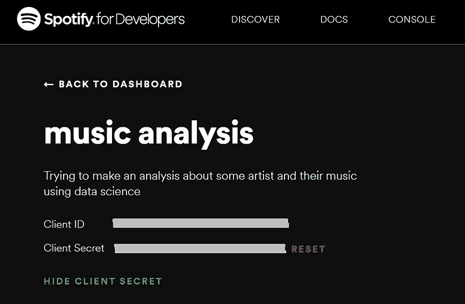
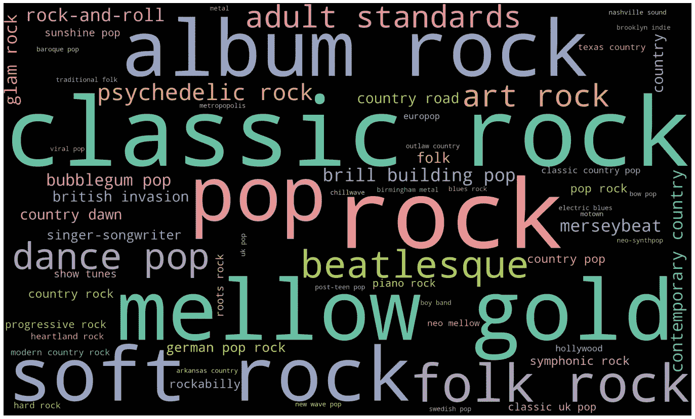
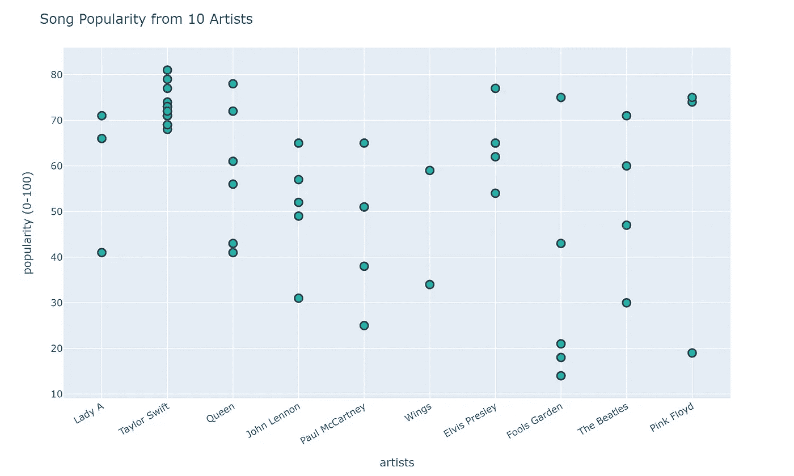

# Python 和 Plotly 版 2020 年 100 首热门歌曲

> 原文：<https://medium.com/analytics-vidhya/your-top-100-songs-2020-in-python-and-plotly-2e803d7e2990?source=collection_archive---------9----------------------->

## 我查看了 Spotify 去年生成的“2020 年你最喜欢的歌曲”播放列表，并把它放到了 Python 中。这是我到目前为止发现的关于我的音乐品味。


在 [Unsplash](https://unsplash.com?utm_source=medium&utm_medium=referral) 上由 [Mohammad Metri](https://unsplash.com/@mohammadmetri?utm_source=medium&utm_medium=referral) 拍摄的照片

Y 你可能会注意到，在年底，你的朋友会把他们那一年在 Spotify 上的顶级艺术家和热门歌曲发布到他们的社交媒体上。我做到了。不管你是喜欢你朋友的音乐品味(还是觉得你朋友没品味)，你都忍不住到处看到#SpotifyWrapped。

如果你从未使用过 Spotify，也不熟悉#SpotifyWrapped，基本上，它是 Spotify 在每年年底发布的一项功能，向你展示一年中最难忘的聆听时刻。此外，他们还生成了一个全年播放次数最多的歌曲的播放列表。去年它被称为“2020 年你的最佳歌曲”。


Spotify 为每位用户创建了一个播放列表，其中包含全年播放次数最多的 100 首歌曲。

# 我的 Spotify 打包了

老实说，除了我喜欢世界上最著名的乐队[](https://en.wikipedia.org/wiki/The_Beatles)*和我听了太多伤感的&醇厚的音乐之外，我不认为我听的音乐有什么可夸耀的。大概吧。至少，这是我目前为止的假设。这是 Spotify 去年对我的发现。*

****

*2020 年我的 Spotify 顶级艺术家和歌曲*

*甲壳虫乐队是我最喜欢的艺术家，这可能并不奇怪；自从五六年前我发现它们以来，它们一直都是这样。*

*我实际上发现非常有趣的事实是，尽管是我的顶级艺术家，他们的歌曲没有占据我的前五名歌曲的任何位置。我的猜测是，尽管我听了很多 Fab Four 乐队的歌，但我没有重复听过任何一首特定的歌。我光明正大地听完了他们的全部唱片。*

**

*"帅哥们来了。"—鲍勃·博尼斯档案馆的甲壳虫乐队*

*所以，我的#SpotifyWrapped 说够了。让我们进入我将播放列表放入 Python 的要点。*

# *代码和数据*

*只是提醒一下，我已经在 Github 上放了一个笔记本，里面包含了这里展示的所有代码。可以自己下载试试。链接在本文末尾，所以向下滚动到底部。*

*另外，快速说明一下，你在 2020 年 12 月的收听活动不包括在 Spotify Wrapped 或“你的 2020 年热门歌曲”播放列表中。所以，即使我玩了很多[](https://www.youtube.com/watch?v=EXLgZZE072g)**和 [*麦卡特尼三世*](https://www.youtube.com/watch?v=fF3Q24CX2C4) ，它们也不算，因为那两张专辑是 12 月才发行的。***

## **使用 Spotify API**

**我使用了一个名为[*Spotify 库来访问他们的 API。这是一个用于 Spotify Web API 的轻量级 Python 库。有了 Spotify，你可以完全访问 Spotify 平台提供的所有音乐数据。您可以按照文档中的步骤在您的环境中安装它。*](https://spotipy.readthedocs.io/)**

**在我们开始之前，您必须通过访问这个 [Spotify 开发者仪表板](https://developer.spotify.com/dashboard/applications)获得自己的客户端 ID，并创建一个应用程序(您必须先登录)。我把我的应用程序命名为“音乐分析”。如果你点击它，你会被引导到一个页面，在那里你可以为你的应用程序复制你的客户端 ID 和客户端密码。**

********

**Spotify 开发者仪表板**

**在我们开始工作之前还有一件事。你必须获得你的 Spotify 播放列表 URI，你可以通过进入你的 Spotify 桌面应用程序并复制它，如下图所示。**

****

**从 Spotify 桌面获取“2020 年你最喜欢的歌曲”播放列表的 URI**

**我希望到目前为止你觉得事情很容易。现在我们已经有了我们的*客户端 id、客户端秘密*和 Spotify 播放列表 URI，我们可以直接进入代码了。开始了。**

## **获取数据**

**首先，你需要设置你的变量。你必须用你之前得到的 URI 替换播放列表 URI，用你自己的替换 CLIENT_ID 和 CLIENT_SECRET。**

```
**import spotipy
from spotipy.oauth2 import SpotifyClientCredentialsplaylist_uri = 'spotify:playlist:37i9dQZF1EMh2NooMxxxxx'
spotify = spotipy.Spotify(client_credentials_manager=SpotifyClientCredentials(CLIENT_ID, CLIENT_SECRET))**
```

**然后下面的代码将获取您的播放列表数据。您获得的数据将是 JSON 格式的，因此为了便于阅读，我们将其转换为 pandas 数据框。你会看到一个包含一行的数据框，它是你的播放列表的数据。**

```
**import pandas as pdplaylist = spotify.playlist(playlist_uri)
pd.json_normalize(playlist)**
```

**记住只是你的播放列表数据，而不是播放列表中每首歌的数据。为此，我们必须用下面的代码获取每个项目(歌曲/音轨，如果你想调用它的话)。**

```
**playlist_items = spotify.playlist_items(playlist_uri)
playlist_items**
```

**上面的结果仍然是 JSON 格式的，所以让我们将它转换成一个数据框，并更改它们的几个列名，以便于阅读。**

```
**df = pd.json_normalize(playlist_items['items'])
filter_cols = [col for col in df if col.startswith('track')]
df = df[filter_cols]
df.columns = [col.replace("track.","") for col in df]
df.head()**
```

**如果您愿意，可以将此数据框保存为 CSV 文件，这样您就不需要在每次打开代码时再次运行代码从 Spotify 获取数据。**

**如果您想知道该数据框中有哪些数据，可以查看它们的列。**

****

**正如你在上面的截图中看到的，这个数据框包含了该曲目的专辑信息(专辑名称、专辑艺人、发行日期)、曲目本身信息(曲目时长、曲目名称、流行度等)以及其他相关信息。**

**下面就来看看我的前 10 首歌吧。艺术家的数据有点棘手，因为他们仍然在 JSON 中，但这里有曲目名称和专辑名称。**

****

**如果你没有注意到，歌曲是按照你的播放频率排序的。所以一首歌的排名/位置越高，意味着你播放它的次数比位置较低的歌多。在这种情况下，我播放**女士 A** (第一位)的《[如果我永远忘不了你](https://www.youtube.com/watch?v=rbFj2t9d7Z8)怎么办》比我播放**英格丽德·安德烈斯**(第四位)[比我的心多](https://www.youtube.com/watch?v=j_A8Zjwr9m0)。顺便说一下，这两首歌都很棒！**

**现在我们来看看艺术家们的数据。就像我之前说的，这很棘手，因为它在 JSON 中。**

****

**有两个选项，您可以从“album.artists”列获取艺术家的信息，也可以从“artists”列获取。正如你在上面的截图中看到的，它们略有不同。《放逐》这首歌属于泰勒·斯威夫特的《民间传说》专辑，但这首歌本身也有本·艾弗的特色。这就是为什么在“album.artists”一栏中，你只能看到泰勒的名字，但在“artists”一栏中，你还能看到 Bon Iver 的名字。**

**出于简单的原因，我将获得艺术家的信息，但只有主要的艺术家，这是首先提到的。在上面的例子中，这意味着我将只得到泰勒斯威夫特，而离开邦艾弗。我将获得每个艺术家的追随者数量、音乐流派和受欢迎程度的信息。你通过收集每个艺术家的 URI 来做到这一点。**

```
**data = []for a in df['artists']:
    result = pd.json_normalize(a)
    name = result['name']
    uri = result['uri']

    artist_info = spotify.artist(uri[0])
    followers = artist_info['followers']['total']
    genres = artist_info['genres']
    popularity = artist_info['popularity']

    data.append((name[0], followers, genres, popularity))

df1 = pd.DataFrame(data, columns = ('artist', 'followers', 'genres', 'artist_popularity'))**
```

**现在，您可以为播放列表中的每个艺术家获得一个整洁的数据框。我还会添加一些关于每首歌的名字和受欢迎程度的信息。**

```
**df1['song'] = df['name']
df1['song_popularity'] = df['popularity']**
```

**你可能会看到有几位艺术家多次出现在播放列表上(泰勒·斯威夫特、甲壳虫乐队及其独唱、平克·弗洛伊德和奎恩当然也是)。我想要一个包含艺术家等级的数据框，没有重复的信息。**

```
**df1['rank'] = range(1, len(df1)+1)
unique_artists = df1[['artist', 'followers', 'rank', 'artist_popularity']].drop_duplicates(subset=['artist'], keep='first')
unique_artists**
```

****

**好了，我们已经得到了我们需要的数据，现在让我们做有趣的部分！可视化！**

# **阴谋营救！**

**最近工作的时候，我一直在和 [**一起玩**](https://plotly.com/python/) ，我想让别人知道这个库有多棒。以前，我是 Matplotlib 的多年用户。一开始，向 Plotly 的转变很令人困惑，但我最终习惯了。希望你自己试用后也会喜欢。**

## **我听的艺人有多少粉丝？**

**我的第一张图是关于我的顶级艺术家的追随者数量。你可能会想，我是听当红艺人的还是听不出名的？嗯，答案就在这里。**

```
**import plotly.express as px
import plotly.offline as pyo 
pyo.init_notebook_mode()fig = px.scatter(unique_artists, y="followers", text="artist",
                 hover_name="artist")
fig.update_layout({"title": "Followers of Artists on My Spotify Top 100",
                   "xaxis": {"title":"artists"},
                   "yaxis": {"title":"Artist's Followers"}})fig.update_traces(textposition='top center')
fig.update_traces(marker=dict(size=10, color='forestgreen',
                              line=dict(width=2,color='DarkSlateGrey')),
                  selector=dict(mode='markers'))
fig.show()
fig.write_image("pics/followers.png",format="png", width=1000, height=600, scale=3)**
```

****

**我听的大部分艺人粉丝都不到 500 万，只有极少数粉丝超过 1000 万。更多的追随者并不总是等于受欢迎，但你可以知道哪些艺术家更受欢迎。**

## **流派分布怎么样？**

**我对上述问题的初步猜测是，我可能没有听足够多的不同音乐流派。我倾向于坚持古典摇滚和乡村音乐，因为我有时会有点过于柔和圆润。**

**您将每个艺术家的所有流派收集到一个列表中，如下面的代码所示。**

```
**genres =[]
for row in df1['genres']:
    for r in row:
        genres.append(r)
genres = pd.Series(genres)**
```

**图来了。**

```
**import plotly.graph_objs as gotop_genres = genres.value_counts().nlargest(20)fig = go.Figure([go.Bar(x=top_genres.values, 
                        y=top_genres.index,
                        orientation='h',
                        text=top_genres.values, 
                        textposition='outside',
                        marker_color='rebeccapurple')])
fig.update_layout(title_text='Most Frequent Music Genres Found on My Spotify Top 100',
                  yaxis=dict(autorange="reversed")
)
fig.show()
fig.write_image("pics/most-genres.png",format="png", width=1000, height=600, scale=2)**
```

****

**我还试着用同样的数据做了一个单词云。**

```
**import matplotlib.pyplot as plt
from collections import Counter
from wordcloud import WordCloud
%matplotlib inline

genre_counter = Counter(genres)wordcloud = WordCloud(width = 2500, height = 1500, random_state=10, background_color='black', colormap='Set2').generate_from_frequencies(genre_counter)
plt.figure(figsize=(25, 15))
plt.imshow(wordcloud) 
plt.axis("off")**
```

****

**我最常听的流派，从经典摇滚，流行，到男孩乐队和好莱坞**

**谈到 Spotify 提供的音乐流派，他们的数据科学家创建了一个很酷的网站，可以分解和探索每种音乐流派。看看 everynoise.com 的。**

## **我的前 100 名里哪些艺人的歌最多？**

**我们已经知道我的头号艺人是披头士，但是他们的歌有多少真的在我的前 100 名里？**

```
**a = df1['artist'].value_counts().nlargest(10)fig = go.Figure([go.Bar(x=a.index, 
                        y=a.values, 
                        text=a.values, 
                        textposition='auto',
                        marker_color='seagreen')])
fig.update_layout(title_text='Artists with Most Songs on My Top 100')
fig.show()
fig.write_image("pics/most-songs.png",format="png", width=1000, height=600, scale=2)**
```

****

**显然，**泰勒·斯威夫特**用 16 首歌统治了我的播放列表！同时，甲壳虫乐队在我的播放列表中只有四首歌曲。但是考虑到约翰·列侬和保罗·麦卡特尼每人都有五首歌(更不用说翅膀了)，我想可以肯定地说我真的离不开那些来自利物浦的男孩，嗯？**

## **这些歌曲有多受欢迎？**

**下一张图，我想知道我听过的前 10 位歌手的歌曲有多受欢迎。**

```
**a_idx = df1['artist'].value_counts().nlargest(10).index
artist_album = df1[df1['artist'].isin(a_idx)]fig = px.scatter(artist_album, x="artist", y="song_popularity",
                hover_data=["song", "song_popularity"])
fig.update_layout({"title": "Song Popularity from 10 Artists",
                   "xaxis": {"title":"artists", "tickangle":-30},
                   "yaxis": {"title":"popularity (0-100)"}})fig.update_traces(marker=dict(size=10, color='lightseagreen',
                              line=dict(width=2,color='DarkSlateGrey')),
                  selector=dict(mode='markers'))fig.show()
fig.write_image("pics/song-popularity.png",format="png", width=1000, height=600, scale=2)**
```

****

**当谈到泰勒·斯威夫特的音乐时，我显然倾向于只听他们最受欢迎的歌曲，我承认我可能比其他人更喜欢听《情人》和《T21》。对于女王和女士，我倾向于听他们更受欢迎的歌曲，虽然我也会探索一下他们不太受欢迎的歌曲。**

**然而，当谈到愚人花园乐队或 T2 时，我听的歌曲范围更广。比如关于麦卡特尼的音乐，我相信大多数人都听说过麦卡特尼 I 的代表作《T4》【也许我很惊讶】，但似乎没有多少人知道麦卡特尼 II 的《瀑布(这首歌的流行度评分不到 30)。我知道我参加派对要迟到了，因为我去年才发现那首好歌！**

**与此同时，在**平克·弗洛伊德**那条线上下边的那个小点，就是“[朱丽亚的梦](https://www.youtube.com/watch?v=SPBfx4_WT-w)”。我不知道这首歌不是真的受欢迎，相对于上面的另外两个点，“[希望你在这里](https://www.youtube.com/watch?v=hjpF8ukSrvk)”和“[墙里的另一块砖，Pt。2”](https://www.youtube.com/watch?v=zz8frWcmthA)。我发现有趣的是，我听的歌曲和我听的 Pink Ployd 的歌曲之间真的有很大的差距。**

## **我最喜欢的音乐年份是哪一年？**

**现在我们要做一个图表，把我听得最多的歌曲的发行年份可视化。**

**你需要先从专辑发行日期中得到年份，然后列出它们。**

```
**df['release_year'] = pd.to_datetime(df['album.release_date']).dt.year
by_year = df['release_year'].value_counts()
idx = list(range(min(by_year.index), max(by_year.index)+1))
s = by_year.reindex(idx, fill_value=0)**
```

**接下来，我们将这些数据放入条形图中。**

```
**fig = go.Figure([go.Bar(x=s.index, 
                        y=s.values,
                        marker_color='indianred')])
fig.update_layout(title_text='Top Songs from Each Year')
fig.show()
fig.write_image("pics/release-year.png",format="png", width=1000, height=600, scale=2)**
```

****

**这是我喜欢向我的朋友指出的地方，他们经常指责我只听老歌，他们错了。我的前 100 首播放列表中的大多数歌曲都是 2020 年的。总之，尽管我喜欢经典和老歌，我也听了很多新歌。**

**为了简单起见，我还会做一个条形图，不是按年，而是按十年，因为毕竟我们喜欢用那个十年的音乐来定义时间，对吗？**

```
**df['decade'] = df['release_year'].apply(lambda x: int(np.floor(x / 10) * 10))
d = df['decade'].value_counts().sort_index()fig = go.Figure([go.Bar(x=d.index, 
                        y=d.values, 
                        text=d.values, 
                        textposition='auto',
                        marker_color='indianred')])
fig.update_layout(title_text='Top Songs from Each Decade')
fig.show()
fig.write_image("pics/release-decade.png",format="png", width=1000, height=600, scale=2)**
```

****

**当你把数据按十年分类时，你会发现我的前 100 首歌大多是从 2000 年开始的。我得告诉我的朋友，我的音乐品味还没那么老。**

**只是有点吹毛求疵，一些新的歌曲翻唱可能会有翻唱发行的年份，而不是歌曲的原始年份。例如，**保罗·麦卡特尼**的《美丽的夜晚》最初是在 1997 年从专辑*燃烧的馅饼*中发布的，但这首歌在 2020 年的重制中被重新发布。这首特别的歌曲被列为 2020 年的歌曲。但是，这种情况很少发生，所以我可以忽略它。大部分 2010 年代和 2020 年代的歌曲确实来自那几十年。**

**我认为我在本文中向您展示的代码和图表已经足够了。希望你从中找到一些有帮助的东西。**

# **结论**

**从这篇文章中我实际上可以得出的结论是，我需要听和探索更多的音乐流派！Spotify 是我发现新艺术家和流派的一个很好的工具，我很喜欢它。我希望在 2021 年，你也能发现许多伟大的歌曲，并与他们一起创造新的，伟大的回忆。#SpotifyWrapped2021 再见！**

**你可以点击下面我的 Github 链接，查看并下载我在本文中使用的全部代码。**

**[](https://github.com/catris25/myspotify-top100-2020) [## catris25/myspotify-top100-2020

### 通过在 GitHub 上创建一个帐户，为 catris25/myspotify-top100-2020 开发做出贡献。

github.com](https://github.com/catris25/myspotify-top100-2020)**