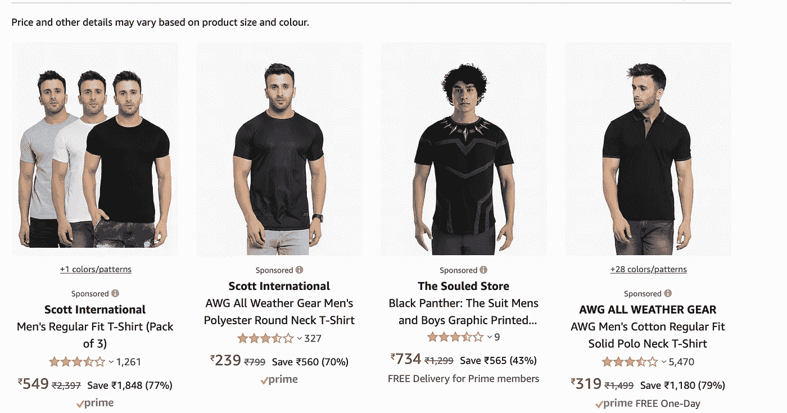
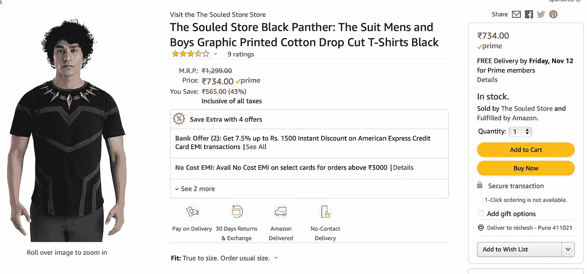
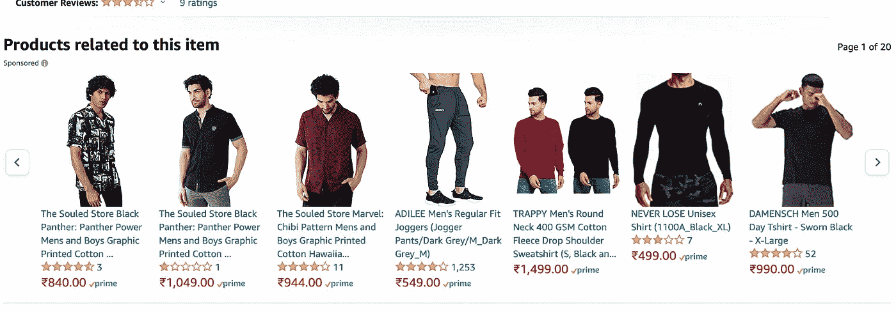
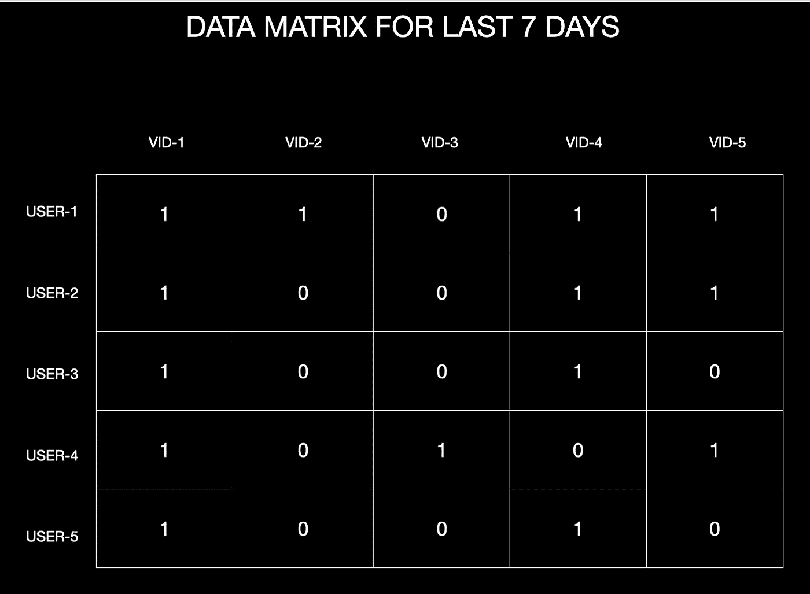
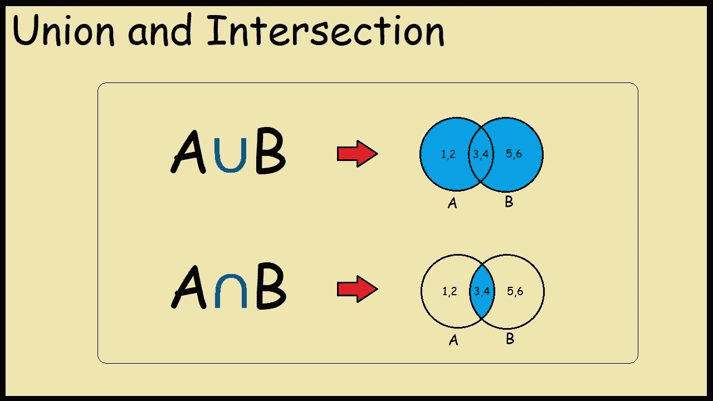

# 对 Youtube 推荐系统的直观理解

> 原文：<https://medium.com/analytics-vidhya/youtube-recommendation-system-fe2c8024721d?source=collection_archive---------9----------------------->

如今，对于任何公司来说，推荐系统都已经成为至关重要的一部分，每个公司都希望给用户提供个性化的体验，对于这种推荐，系统是最佳选择。

**让我们了解一下什么是推荐系统……**

假设你想从亚马逊买一件 t 恤，你去他们的网站输入黑色 t 恤，

你会得到这样的东西，

你会在你的屏幕上看到一些黑色 t 恤，简单吧？？？

现在，假设您喜欢第一页上的一些 t 恤，并走进去查看它们，假设您选择了左起第三件 t 恤(黑豹一号)，您检查了它的评论、评级等。

现在，你回到第一页，选择一些不同的黑色 t 恤，比如说圆领的，或者某个品牌的 t 恤等等。

现在，如果你注意，亚马逊正在收集每一个信息，你的每一次点击，每当你去一个特定的品牌或特定的模式，亚马逊已经开始知道你喜欢什么，不喜欢什么。

这就像我们说你和一个新朋友去最近的市场买一件 t 恤，这个新朋友不知道你喜欢或不喜欢什么，他只是在观察你，他在注意你的每个动作，

你在选择什么样的模式？？你在选择什么品牌？？你选择什么颜色？？

等等等等…

亚马逊是那种不必要的朋友，每当你在它的网站上买东西的时候，它都会盯着你。

现在的问题是为什么亚马逊收集你的每一点信息？？？

答案非常简单，亚马逊希望你根据你可能喜欢的东西或者你可能从它的网站上购买的东西来推荐一款产品，如果你仔细想想，这是一个非常美好的想法。

假设您计划购买一件 T 恤衫，就像我们之前看到的那样，但是在搜索 T 恤衫时，您非常喜欢这件黑色 T 恤衫，现在刚刚进入黑色 T 恤衫的页面查看它的价格、评论等，您并不打算购买这件 T 恤衫，您只是在观看它。

现在，当你进入黑色 t 恤页面时，你会看到类似这样的内容，与该商品相关的产品

如果你喜欢带有豹纹的黑色 t 恤，你也有更多的机会喜欢这些 t 恤。

亚马逊内部正在做的是，找到与你正在看的 t 恤最相似的 10 件 t 恤，因为一个简单的假设，

“如果你喜欢这件 t 恤，那么你就有更多的机会喜欢类似的 t 恤”

这就是亚马逊向我们销售产品的方式。

仅从推荐系统，亚马逊就获得了 400 亿美元的业务，这是一个很大的数字，这就是亚马逊每天都在用新技术增强其推荐系统的原因。

**让我们建立一个简单的 Youtube 推荐系统……**

在开始之前，让我澄清一下，实际的 Youtube 推荐系统比我们在这里讨论的要复杂得多，但我的目的是让你了解一下推荐系统内部是如何工作的。

**让我们开始吧……**

现在的问题是 YouTube 在向我们推荐什么，为什么 YouTube 中需要一个推荐系统？

现在，YouTube 通过在视频之间向我们展示广告来赚钱，所以用户在 YouTube 上停留的时间越长，公司赚的钱就越多，所以基本上，我们的时间就是他们的钱。

所以他们想看我们喜欢看的东西，这就是他们使用推荐系统的原因。

正如我们在亚马逊上看到的，重要的是我们的数据，那么 YouTube 是如何收集我们的数据的呢？？

我们的 YouTube 历史，我们的位置，我们的名字，我们的邮件 id，甚至我们的谷歌搜索历史，所有这些都属于 YouTube，这是大量的数据。

现在为了简单起见，假设 YouTube 只有我们的 YouTube 观看历史，它知道我们在 YouTube 上看到了什么。

让我们看一个可靠的例子，这样你可以更好地想象事情，

我们有一个数据矩阵，用户 1、用户 2、用户 3、用户 4、用户 5 属于 YouTube 的用户，vid1、vid2、vid3、vid-4、vid-5 属于 YouTube 上的可用视频，我们在这里假设 YouTube 上只有 5 个用户，YouTube 上只有 5 个视频，现在矩阵中有 1 的地方，就意味着用户已经看过那个视频，有 0 的地方，就意味着用户没有看过那个视频。比如说-

用户 1 已经看到了视频 1、视频 2、视频 4 和视频 5，但是没有看到视频 3

类似地，用户 5 已经看到了视频 1 和视频 4，但是没有看到视频 2、视频 3 和视频 5。

**现在让我们来理解问题陈述，**

*   假设我们有 5 个视频，v1(板球)，v2(烹饪)，v3(锻炼)，v4(板球)，v5(板球)。
*   假设我们有一个名为“Rohan”的用户 1，他观看了上周的 5 个视频中的 v1(板球)、v2(烹饪)、v5(板球)，现在的任务是向“Rohan”推荐一些与 v1、v2 和 v5 相似的视频。
*   所以在 v3(健身)、v4(板球)之外，推荐系统应该能挑出 v4，因为它与 v1 和 v5 最相似。
*   因此，如果我们能够根据现有数据找到视频之间的“相似性”，我们的问题就解决了。
*   概念很简单，“如果 Rohan 在历史上多次看到一个板球视频，那么他在未来看到一个板球视频的可能性更大”。
*   因此，如果 v4 是一个板球视频，那么我们可以说 v1、v5 和 v4 应该是相似的，并且大多数用户必须一起观看它们，采用这种说法，我们将发现相似性。

现在，如果有一种方法可以找到视频之间的相似性，那么我们的工作就完成了，但我们需要确保这种相似性只来自我们拥有的数据矩阵。

所以，如果我只是使用一个我们在第 10 节课上学过的简单的交集概念，请参考下面的图片来理解并集和交集。

现在从上面的图像我们可以说，vi(视频 I)和 Vj(视频 j)之间的相似性被定义为观看了这两个视频的用户的交集，然后我们计算观看了这两个视频的用户的数量。

这是理解相似性函数的一个非常简单的方法，可以有更好的方法来定义它，但是在这篇文章中，我们简化了一些事情来更好地理解推荐系统。

现在，如果我们想要找到视频 1 和视频 5 之间的相似之处(参考示例)，那么我们可以说 5 个用户中有 3 个看过这两个视频(u1+u2+u4)，因为它们都属于 cricket。

相似度(v1，v5)={u1，u2，u4}，大小为 3，

相似性得分是 3 相似性(v1，v4)={u2，u3，u5}，大小是 3，相似性得分是 3

相似性(v1，v2)={u1}，

相似性得分为 1 相似性(v1，v3)={u4}，大小为 1，相似性得分为 1

相似度(v5，v4)={u1，u2}，大小为 2

相似度(v5，v3)={u4}，大小为 1

相似度(v2，v4)={NULL }，大小为 0(没有用户一起看过 v2 和 v4)

相似度(v2，v3)={NULL }，大小为 0(没有用户一起看过 v2 和 v3)

由此我们可以说，v1 和 v5 之间的相似性是 3，这是最高的数字，并且从问题陈述中，我们知道 v1 和 v5 都属于 cricket，因此它们的相似性得分一定很高。

因此，如果 Rohan 没有看过 v3(锻炼)和 v4(板球),推荐系统必须决定这两个视频中的哪个视频必须推荐给 Rohan，它将如何决定？？

例如，它将看到 Rohan 观看的视频之间的相似性分数，

Rohan 已经观察了 v1，因此它将检查 v1 和 v4 之间的相似性分数，该分数将是 3，然后它将检查 v1 和 v3 之间的相似性分数，该分数将是 1

现在 Rohan 也观察了 v5，所以 v5 和 v4 之间的相似度将是 2，然后它将检查 v5 和 v3 之间的相似度，这将是 1

现在，Rohan 终于也观察到了 v2，因此 v2 和 v4 之间的相似性将为 0，然后它将检查 v2 和 v3 之间的相似性，这将为 0。

因此，很明显，在 v3 和 v4 中，推荐系统将为 Rohan 选择 v4，因为它与 Rohan 观看过的视频的相似性得分高于 v3。

我希望你们了解推荐系统。我想再次澄清一件事，这是一个非常基本的推荐系统，实际的系统要复杂得多。

## 感谢您的阅读…

# 尼舍什·戈吉亚

*   ***如果你喜欢这个，*** [***跟我来这里***](/@nishesh.kumar) ***了解更多***
*   ***有兴趣合作吗？下面我们连线上***[***insta gram***](https://www.instagram.com/nishesh_gogia/)