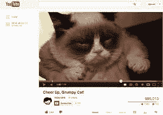
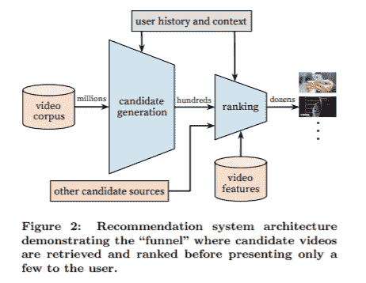
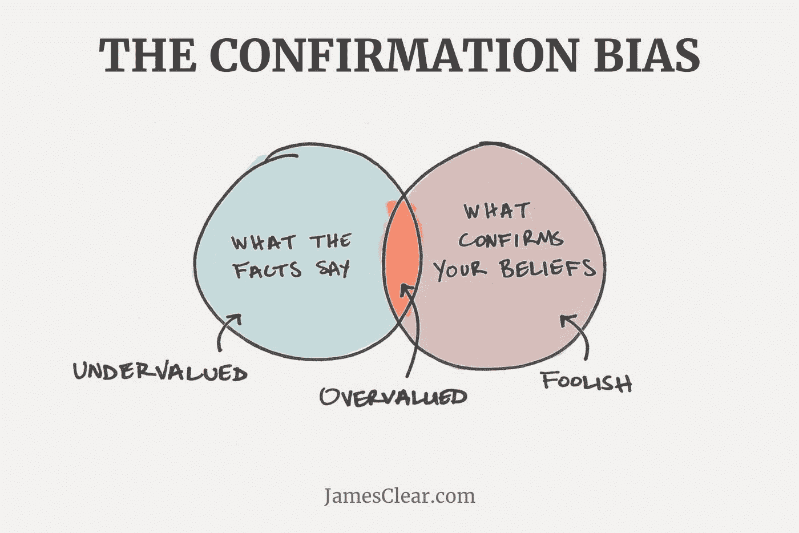
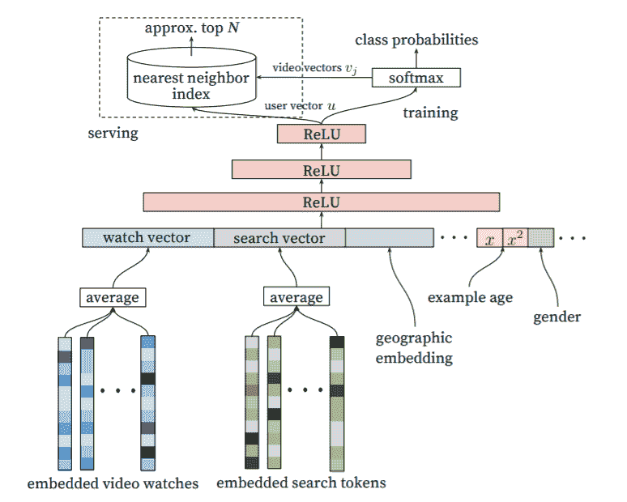
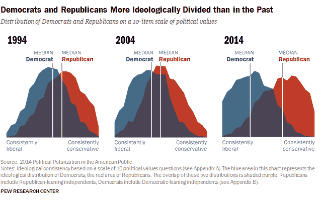

# Youtube 的推荐系统和确认偏差的影响

> 原文：<https://medium.com/analytics-vidhya/youtubes-recommendation-system-and-confirmation-bias-c81ae7481dec?source=collection_archive---------12----------------------->

YouTube 是现存最大、最复杂的行业推荐系统之一的所在地。不管我们喜欢与否，我们在网络上的大部分体验都是由这些强大的推荐系统塑造的，为我们提供了我们预计会参与和消费的内容。但是，由于这些个性化算法，每个用户的互动和对互联网的看法到底有多么不同。YouTube 的推荐系统的主要特点是内容是以用户为目的通过算法生成的，并且是不断学习的。这两个特征都会导致用户的确认偏差。这篇文章将深入探讨系统的底层技术，以及系统设计中可能出现的有趣问题。我将通过确认偏差的镜头来检查这些问题点。

## YouTube 是什么？

除了互联网上最大的猫视频集合之外，它还是互联网上第一个被广泛采用的视频上传和流媒体服务。

## YouTube 有趣的事实

*   第一个视频上传于 2005 年 4 月 23 日
*   于 2006 年 11 月以 16.5 亿美元收购
*   一分钟上传 300 小时的视频
*   每天观看 50 亿个视频
*   每天观看 1.08 亿小时的视频

## 推荐系统

斯坦福信息实验室将推荐系统定义为“一类涉及预测用户对选项的反应的网络应用”。这听起来很简单，但当你在 YouTube 上运行时，有数百万并发用户，每分钟上传 300 小时的视频，推荐问题就变得有点棘手了。

行业推荐系统是标准推荐系统的升级，位于三大领域的交汇处。

> 大数据+机器学习+人机交互

YouTube 的行业推荐系统正在处理世界上最大和增长最快的数据集之一。该系统的目标是尝试向用户呈现用户最有可能点击的几个视频(从数十亿个视频中选出)。为了预测这些视频，系统需要考虑历史用户数据，并且通常知道人类如何与其服务交互。

## 推荐系统和人机交互

随着时间的推移，行业推荐系统(IRS)变得更加强大，也更加个性化。这种个性化决定了在影响你日常生活的服务上向你显示的内容。下面列出了利用 IRS 的常用网站的示例…

*   亚马逊—产品推荐
*   谷歌—网页、图片、新闻等…
*   网飞—电影和电视节目推荐
*   yelp——餐馆推荐
*   Youtube —视频推荐

人机交互镜头对于研究这些算法如何支配你的在线体验和感知是必要的。以亚马逊为例，在一家普通的杂货店，当你走过过道时，产品被放置在大多数普通公众需要、想要或将购买该商品的想法上。亚马逊类似于普通的杂货店，但每个过道和货架都是根据用户定制的。这些 IRS 动态地设置你走过的每个通道的货架，并根据你购买它的估计概率放置每件商品。根据收集到的大量人口统计数据、个人数据和历史数据，根据您的喜好量身定制。

## YouTube 推荐:系统概述

下面是谷歌关于用于 YouTube 推荐的[深度神经网络的白皮书](https://research.google.com/pubs/pub45530.html)中的图表，它在高层次上描述了他们的推荐系统，并专注于深度学习带来的改进。

[深度神经网络为 YouTube 推荐](https://research.google.com/pubs/pub45530.html)

谷歌将推荐系统视为一个极端的分类问题。该系统由两个深度神经网络组成。第一个网络完成候选人生成的工作。第二个网络完成对从候选生成网络输送到它的输出进行排序的工作。

候选生成网络将 YouTube 的视频语料库(大约上亿个视频)以及用户历史和背景作为输入。该网络将过滤视频语料库，筛选出数百个可供推荐的潜在视频。

排名网络具有三个输入源:候选生成网络的输出、关于这些候选的更深层次的视频特征以及其他候选源。排名网络的输出从最高到最低排序，从 0 到 1 的归一化输出表示对用户点击所讨论的视频的可能性的预测。输出是几十个视频的数量级，这些视频中的前 N 个将根据它们在网站中的位置推荐给用户。

在这篇博文的最后，我们将再次讨论候选生成网络架构，并检查它在设计层面可能引入确认偏差的潜在向量。在下一节中，我将介绍确认偏差的概念。

## 确认偏差

“确认偏差产生于欲望对信念的直接影响”——今日心理学。下图完美而优雅地总结了确认偏差:

上面我们有两组，一组是“事实所说的”，另一组是“证实你的信念的”，证实偏差存在于这两组的交集内。如图所示，这个交叉点倾向于被高估的信息。而第一组中不确认你的信念的信息往往被低估。最后，证实你的信念，但与事实没有交集的信息，纯粹是建立在信念基础上的愚蠢信息。

## YouTube 中的确认偏差

在消化了谷歌关于 YouTube 推荐系统的白皮书之后，候选生成网络是一个组件，它可以在视频甚至被排名之前向视频引入确认偏差。

候选生成系统被设计为将用户的观看向量、搜索向量、地理信息、年龄、性别和一系列其他特征作为输入，这些特征在下图中用“…”表示。这已经将潜在的推荐视频过滤为所有视频的子集，并且该子集将符合用户的偏好，并且很可能不会质疑他们对任何事情的看法。这些推荐的全部目的是输出用户可能点击的视频，最终为他们提供更多的广告。在提供更多广告的激励下，这些推荐系统处于一个*道德模糊的*领域，在那里它们可以操纵用户的确认偏见，鼓励他们参与符合他们当前观点的视频，并且有些真实。

YouTube 的候选生成网络架构

## 确认偏差的后果

确认偏见会导致回音室和社会群体的极端分化，如下图所示。皮尤研究中心每十年进行一次美国两极分化的研究。这项研究提出了十个问题来衡量受访者的政治价值观。从 1994 年到 2004 年，民主党和共和党的中间值大致保持在相同的位置上。然而，在 2014 年，民主党和共和党的中间观点越来越远离对方，表明了两极化的政治气候。

## 结论与讨论

随着软件服务越来越成为我们日常生活中不可或缺的一部分，我们将不得不考虑这些系统中内置的个性化和确认偏见将如何影响我们的日常生活和信息接触。乐观地说，我希望这些服务背后的公司能够努力使推荐系统更加全面，同时仍然符合他们的商业激励。网络人机交互是一个令人兴奋的领域，我很高兴看到未来有更多深入的研究来帮助我们了解人类对不断变化的网络的整体体验。

## 资源

*   [为 YouTube 推荐的深度神经网络](https://research.google.com/pubs/pub45530.html) —谷歌研究，2016
*   [推荐系统章节](http://infolab.stanford.edu/~ullman/mmds/ch9.pdf) —斯坦福大学信息实验室正文
*   [什么是确认偏差？](https://www.psychologytoday.com/blog/science-choice/201504/what-is-confirmation-bias) — Shahram Heshmat 博士关于确认偏差的博客
*   [南加州大学偏见讲座](http://info.marshall.usc.edu/faculty/critthink/Supplemental%20Material/Reducing%20Bias.pdf)——南加州大学马歇尔商学院偏见讲座
*   [减少确认偏差和评估偏差](https://www.researchgate.net/publication/257253025_Reducing_confirmation_bias_and_evaluation_bias_When_are_preference-inconsistent_recommendations_effective_-_And_when_not) — Schwing，Buder，2012