# 从零到管道——构建 scikit-learn 管道以预测泰坦尼克号数据集存活率的初学者指南。

> 原文：<https://medium.com/analytics-vidhya/zero-to-pipeline-beginners-guide-to-building-a-scikit-learn-pipeline-to-predict-survival-on-the-bd9730f6f13b?source=collection_archive---------6----------------------->


在泰坦尼克号上做一个贫穷的男人是不值得的。杰克·道森的生还几率可能在 20%左右

开始编写机器学习代码的一个典型地方是泰坦尼克号数据集——这是 [kaggle](http://kaggle.com) 上最受欢迎的项目之一。我在自己的课程中使用过 titanic 数据集，因此它似乎是我的第一篇机器学习媒体文章的一个很好的起点。

在本文中，我们将简要介绍从 kaggle 加载和探索数据，如何进行一些小的功能工程，最后，如何使用 Scikit-Learn 将所有这些放入一个简单的管道中。如果你不熟悉的话，scikit-learn 的管道库是一个非常有用的工具，它可以在尽可能少的步骤中对数据进行预处理并通过学习算法进行处理。最后，我们将能够预测谁将在我们的测试数据集中幸存下来，并提交给 kaggle 竞赛。前进！

**Google Colab**

首先，我建议你使用 jupyter 笔记本。具体来说，你应该使用谷歌编程文档 google colab。你不需要安装任何东西，只需按照[这个链接](https://colab.research.google.com/)创建一个新的空白笔记本。

**连接到 Kaggle**

你可以手动添加数据，将笔记本与你的 google drive 链接，或将笔记本连接到 kaggle。我将使用后者，因为我们在这里专门讨论 kaggle 数据集。

首先，你需要从 https://www.kaggle.com/me/account 那里得到一个卡格尔令牌。点击链接，在 API 下选择“创建新的 API 令牌”

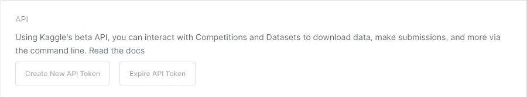

您将下载一个 kaggle.json 文件，我们可以手动将其加载到笔记本中。下面是执行此操作的代码:

注意，该文件必须命名为 kaggle.json 才能工作。现在我们可以运行一个脚本来下载数据集。行首的感叹号让 jupyter notebook 运行代码，就好像是在终端中运行，而不是在 python 内部。

```
!kaggle competitions download -c titanic
```

我们现在已经下载了三个文件:test.csv、train.csv 和 gender_submission.csv。我们将使用 train.csv 来训练我们的模型，并将在 test.csv 上进行预测。gender_submission.csv 是一个有用的指南，可以指导我们应该如何格式化 kaggle 提交(在这种情况下，所有男性都死了，所有女性都活着，这实际上是一个不错的预测)。

是时候载入并探索我们的数据了。我们可以使用。head()方法来查看最上面的行

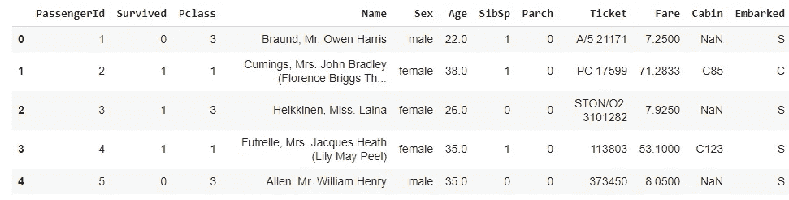

。head()方法

在这一点上，我们有一个可管理的列数，所以我们想通过每一个来理解我们的数据。我们的目标是决定什么对预测有用，什么没用。

我们可以看出 PassengerId 没有任何价值。我们也许可以从名字(小姐 vs 夫人 vs 博士……)做一些特征工程，但是我现在就去掉这个名字。我们还会丢失 Ticket 列，因为它看起来是随机的。

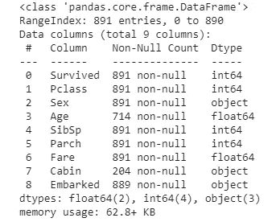

。信息()方法

**特色工程**

我们打电话给。info()方法来检查数据集中变量的数据类型和非空计数。我们希望我们的数据结构良好，这意味着没有任意丢失的值。对于 Cabin，我们只有 204 个非空值。我们不是删除 cabin 列，而是将它变成一个布尔值—无论是否列出了一个 Cabin。

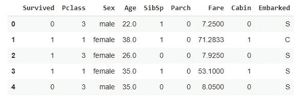

客舱现在是 0 或 1 值

**替换缺失值**

我们已经改变了讨厌的小屋变量。你可能也已经注意到年龄不见了！我们可以丢弃缺少年龄值的样本，或者用可能有意义的东西来填充缺少的值。为了避免事情过于复杂，我们将只使用乘客的中值年龄来添加一个默认的年龄值。这不太可能有助于预测，但也不会破坏系统。

```
Median Passenger Age: 28.0
```

的。fillna()方法用我们的中位年龄 28 替换了所有的空值。

我们还想为那些没有登机点的乘客替换一些缺失的“已登机”值。我将使用最常见的登船方式。

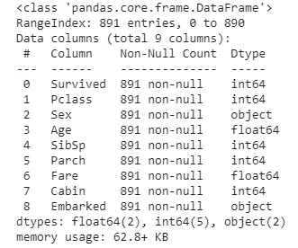

我们不再有任何非空值。耶！但是我们可以用不同的方式来处理这件事…

**使用简单估算器**

有一种更简单的方法可以做到这一点。Sklearn 有一个工具叫 SimpleImputer，它做的和我们刚才做的完全一样，但是更干净，更通用，可以直接用管道工作。一个简单的估算器将填充所有的空数值。我们将重新加载数据，并分离出我们关心的数字列。

变量 **X** 是我们的估算结果，其中所有的值都使用“中值”策略填充。然后，我们重新创建了一个新的数据帧 titanic_tr，来检查我们的结果。如果我们看看。statistics_ parameter，我们可以看到估算者用来填充每一列的值。

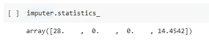

平均年龄是 28 岁，平均费用是 14.4542 美元。

我们也可以使用简单估算器来填充分类数据，我们只需要选择一个与数据兼容的不同策略。

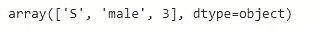

最常登船地点、性别和等级

我们可以使用这些方法来获得新的和干净的数据。但是像“男性”和“C”这样的东西并不能很好地流入简单的数学模型。我们需要更改这些顺序类的值，以确保它们可以用简单的数字方式表示。

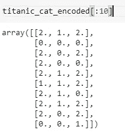

我们现在已经将我们的类别改为从零开始的数字。这对于客运类是有意义的，在客运类中，值之间存在实际的数字关系(类 1 更接近类 2，而不太接近类 3)，这对于性别也是有效的，因为我们数据集中的值是二进制的。然而，0、1 和 2 的编码可能会使装载点的预测不可靠，因为它假设它们之间存在数学关系。以邮政编码为例。虽然从技术上讲，它们是数字，但 22101 并不真的大于或小于 90210，这些数字并不代表真实世界的值。为了解决这个细节，我们使用了被称为**的一键编码**。

**一键编码**

为了避免算法认为 C 更接近 Q 而不是 S，因为 0 更接近 1 而不是 2，我们将数字更改为一位热编码，其中每个数字都更改为 0 和 1 的数组。0 变成[1 0 0]，1 变成[0 1 0]，2 变成[0 0 1]。

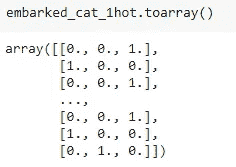

每个值现在都由 0 和 1 的数组表示

**定制变形金刚**

这些编码器很棒，在流水线上工作得很好。但是如果我们想分开做呢？我们的客舱数据就是一个很好的例子——我们希望用 1 替换现有值，用 0 替换空值。我们将为此编写一个自定义的转换器。

**建立管道**

我们已经查看了我们的数据，对其进行了处理，并找出了我们想要对其做什么，以便为训练机器学习算法做好准备。因此，在这一点上，我们可以轻松地构建一个管道，将我们所有的工作包含到一个简单的、逻辑的代码块中。我们所有的转换都是清晰可辨的，我们将添加一个标准缩放器来标准化我们的数值(这对一些算法很有帮助)。这就是管道有用的地方，因为我们可以连续添加多个步骤。

这里我们有三个管道——一个用于数值数据，一个用于客舱数据，一个用于分类数据。现在我们可以将这些合并到一个 ColumnTransformer 中，提供将哪些列输入到哪些管道的名称。

只是为了再看看我们的数据变成了什么，我们可以再次将它加载到 dataframe 中，但我不建议通常这样做。在这一点上，我们应该知道我们的东西看起来像什么，而不需要像这样写标签。

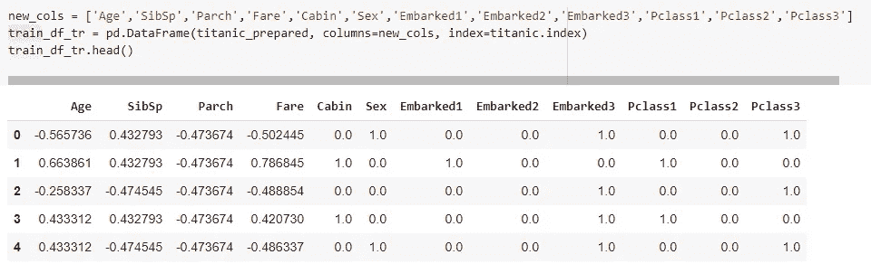

# 培养

太棒了。我们的数据是干净的、数字的，并且可以用于训练。我们将把我们的数据分成训练/测试集(不讨论 test.csv，它实际上是一个验证集，目前还没有任何可供我们使用的解决方案)。然后，我们将通过一个随机梯度下降分类器来运行它——没有什么特别的，只是一个二元分类器。

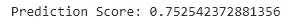

还不错！肯定比 50%强！

# 提交结果

在这一点上，我们可以尝试不同的参数，不同的模型，甚至使用 GridSearch 一次尝试很多各种各样的东西。这是另一节课的全部内容…现在，让我们看看如何创建预测，并像 kaggle 希望我们提交的那样编写一个文件。我们甚至可以通过命令行提交！

我希望这对你有所帮助！这里有一个完整的 jupyter 笔记本(和一些额外的代码)，你可以在这里查看。关注我的更多教程，并查看我在 michaelsmirnov.com[的网站。](http://michaelsmirnov.com)