# Zomato Bangalore 餐厅分析和评级预测

> 原文：<https://medium.com/analytics-vidhya/zomato-bangalore-restaurant-analysis-and-rating-prediction-101fd635ab15?source=collection_archive---------5----------------------->

## 数据清理、EDA 和建模


来源: [Pinterest](https://www.dezeen.com/2020/02/02/romantic-restaurants-pinterest/)

在这里，我们将讨论一个在 Zomato 餐馆数据集上的**端到端机器学习案例研究**。对每个餐厅的描述性分析和预测评级取决于每个餐厅提供的设施和功能。

你可以从 [**这里**](https://www.kaggle.com/himanshupoddar/zomato-bangalore-restaurants) 下载**数据集**和**从 [**这里**](https://github.com/BrahmG/Zomato_case_study/blob/main/Zomato_rating_prediction_bangalore.ipynb) 下载 Ipython 书籍/代码**或者查看 [**这里**](https://nbviewer.jupyter.org/github/BrahmG/Zomato_case_study/blob/main/Zomato_rating_prediction_bangalore.ipynb) 。

**快来看看我的**[**LinkedIn**](https://www.linkedin.com/in/brahm-parkash-12b2a8154/)**简介**

# 问题:-

分析 Zomato 数据集的基本思想是获得一个关于影响在 Bengaluru 不同地方建立不同类型餐馆的因素的公平概念，每个餐馆的综合评级，Bengaluru 是一个这样的城市，有超过 12，000 个餐馆，餐馆提供来自世界各地的菜肴。每天都有新餐馆开业，这个行业还没有饱和，需求与日俱增。然而，尽管需求不断增长，新餐馆与老餐馆竞争已经变得很困难。大多数都供应同样的食物。孟加拉鲁鲁是印度的 IT 之都。这里的大多数人主要依赖餐馆的食物，因为他们没有时间自己做饭。

# 机会:-

从所有可用的数据中，我们可以得出一些清晰的见解或结论，例如

*   *最喜欢的菜式是什么？*
*   *餐厅类型有多少种？*
*   *最喜欢的餐厅类型是什么？*
*   两个人的平均费用是多少？
*   哪个特许经营店最受欢迎，哪个特许经营店的数量最多？
*   是否有送货选项？
*   位置会影响评分吗？
*   *有多少人拥有图书桌设施*

诸如此类…..

# 使用的工具:-

*   Python 3.6
*   Numpy
*   熊猫
*   Matplotlib
*   海生的
*   数据科学
*   机器学习
*   Sklearn

我们开始吧。

你可以在**笔记本**中看到导入库、数据加载、它的信息和一些清理和预处理前的统计数据。

该数据集包含 51717 个数据条目/记录和 17 个列/特征，例如 URL、地址、名称、在线订单、Book_table、评级、电话号码、位置、餐馆类型、喜欢的菜肴、美食、两个人的平均费用、评论列表、菜单等等。

所有的预处理和每个特征/列的清理都在[笔记本](https://github.com/BrahmG/Zomato_case_study/blob/main/Zomato_rating_prediction_bangalore.ipynb)中完成，请看一下。现在让我们来探究每一个专栏或功能。

# 1.探索性数据分析

## 1.1 餐厅名称:-

我们的数据集中有 6859 家在 Zomato 上注册的独特餐馆。其中奥涅斯塔和 CCD 是 Zomato 上最受欢迎的

```
top_20=data.name.value_counts()[:20]
plt.figure(figsize=(10,6))
ax=top_20.plot(kind=’bar’,color=’c’)
plt.title(‘Top 20 restaurants by name’)
plt.xlabel(“Restaurant’s Name”)
plt.ylabel(‘Count’)
plt.show()
```

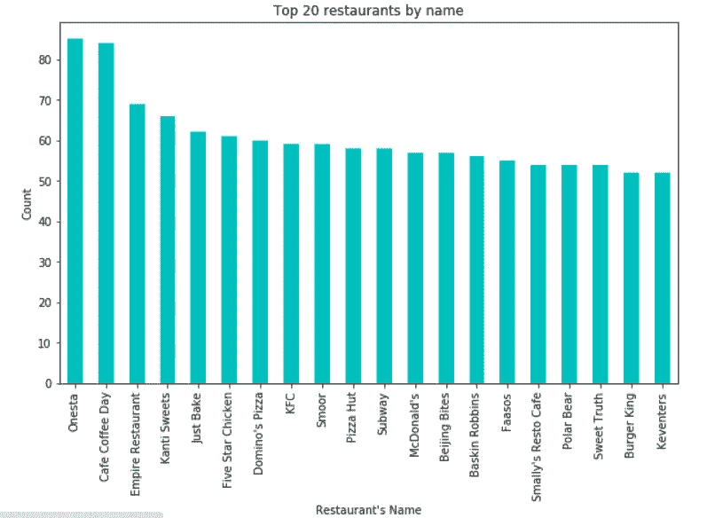

从上面的图表中，我们可以看到，**奥涅斯塔的特许经营店几乎有 100 家。**

## 1.2 在线订单:-

在 Zomato 上所有注册的餐厅中，有多少接受在线订单，有多少不接受。从下图中，您可以了解到班加罗尔有近 30，000 家餐厅通过 Zomato 接受在线订单，其中近 20，000 家不接受任何通过 Zomato 的在线订单。

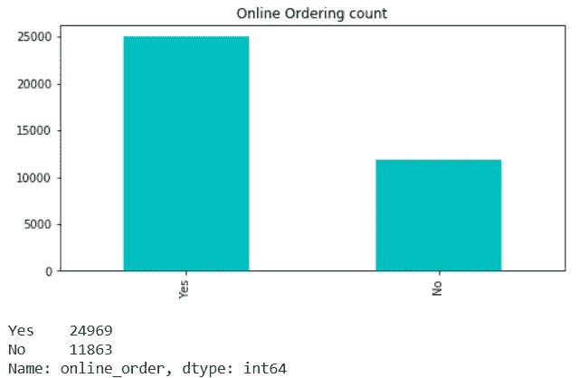

排名前 20 的餐厅及其数量的条形图

从今年(2020 年)可以明显看出，我们必须为变化做好准备。在停业期间，大多数餐馆都遭受了同样的遭遇，在不久的将来，网上也是推动业务发展的唯一安全可靠的选择。

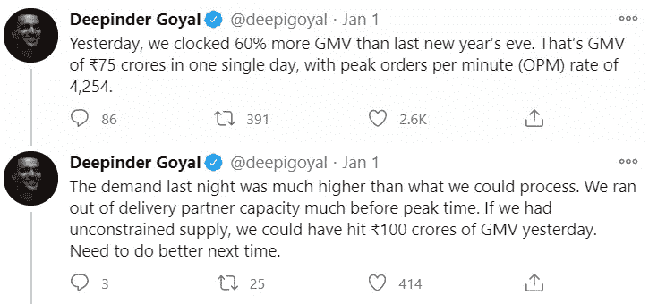

来源:[推特](http://www.twitter.com)

## 1.3 预订表:-

在家舒适地预订餐桌是一种很好的客户体验，因为它增加了您确认餐桌的机会，并减少了通常没有餐桌预订选项时发生的等待时间。从数据中可以明显看出，大多数餐馆似乎还没有这种选择，它们是临时经营的。

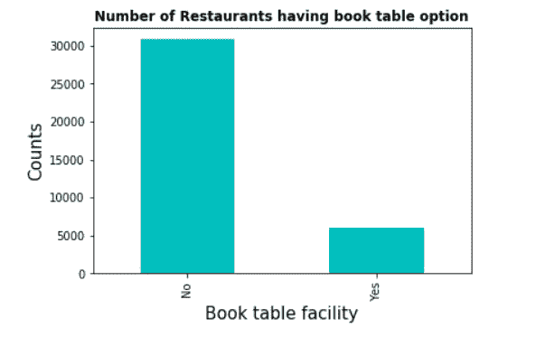

提供预定桌子设施的餐厅数量

## 1.4 餐厅的位置

我们总共有 93 个地点，分布着 51，000 家餐厅。让我们看看哪个在每个地点有更多的餐馆。我们知道饼状图总是 100%的组成，从下面的饼状图中，你可以看到许多餐厅中排名前 10 的餐厅。

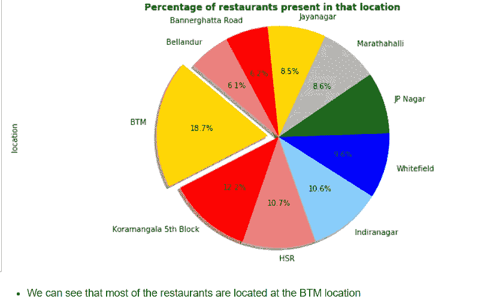

此处仅显示了前 10 个位置。

在上图中，只有前 10 个位置被共享，而我们有 93 个位置。下面你可以看到位置栏的条形图。

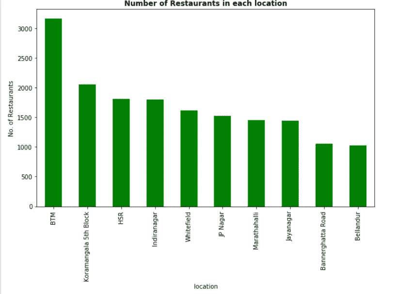

## 1.5 餐厅类型

我们有几个餐厅类型，如快速字节，休闲餐饮，咖啡厅，送货，甜品店，酒吧，美食广场，酒吧，休息室，糖果店等。您只能看到共享饼图的前 6 大餐厅类型。

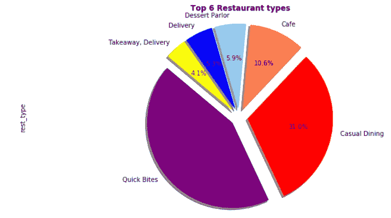

六大餐厅类型

**因此，我们将 Quick Bytes 作为顶级餐厅类型。**

## 1.6 两个人的平均费用

我们有从 300 到 4000 不等的两人套餐，取决于餐厅类型、他们点的菜和他们喜欢的菜肴。让我们看一下 Zomato 班加罗尔所有餐馆中两个人平均消费的甜甜圈图。

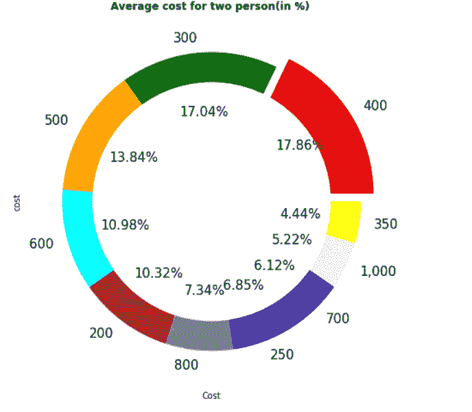

大多数情况下，两个人的平均花费约为 300 印度卢比。

## 1.7 班加罗尔喜欢的菜肴

我们有一个名为 Dishes _ liked 的专题/专栏，它讲述了班加罗尔人喜欢的所有不同类型的菜肴。菜肴，如意大利面，汉堡，比萨饼，Biryani，三明治，paratha 等。让我们从图中看到知道，班加罗尔最喜欢的食物是什么。

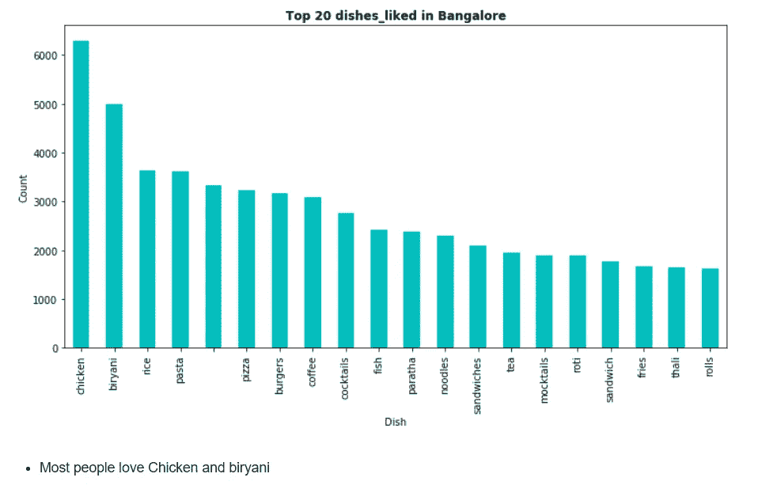

班加罗尔最喜欢的 20 道菜

## 1.8 评级:-

我们还有一个栏目，是所有点餐或光顾过的人对每家餐厅的平均评分。经过分析，我们知道所有餐厅的总收益为 **3.9** ，这意味着在班加罗尔的所有餐厅点菜或就餐都很不错。

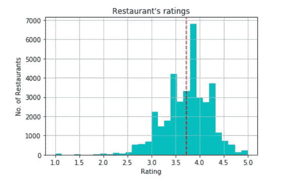

## 1.9 美食:-

我们有班加罗尔餐馆为那里的人们做的几种菜肴，因为他们来自这个国家的不同地区，来自不同的文化。

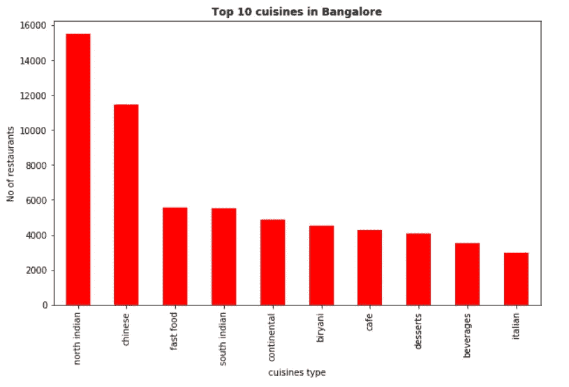

1.10 最喜欢的菜的单词云

单词云是单词的可视化表示，它突出显示出现频率较高的单词。查看[笔记本](https://github.com/BrahmG/Zomato_case_study)获取完整代码。

```
plt.figure(figsize=(12,6)) 
set_dishes=set(dishes)
dish_word_cloud = ', '.join(set_dishes)
wc=WordCloud(background_color='black',stopwords=STOPWORDS,max_words=len(dish_word_cloud))
wc.generate(dish_word_cloud)
plt.imshow(wc,interpolation='bilinear')
plt.title('Word Cloud for favourite dishes',weight='bold')
plt.axis("off")
plt.imshow(wc)
plt.show() 
```

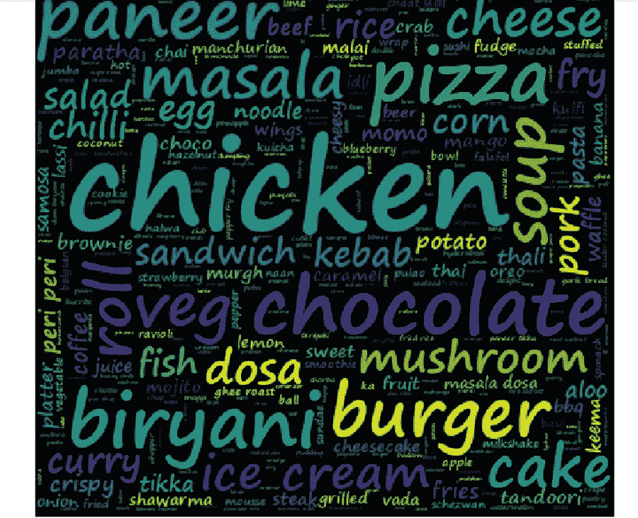

我们有北印度菜、中国菜、欧陆菜、咖啡、快餐和其他几种菜。看了图表后，你可以看到我们有**北印度**是最受欢迎的菜肴。

# 2.模型构建:-

从现在开始，我们将讨论机器学习及其用于预测班加罗尔餐馆评级的模型。

在数据清理和 Eda 之后，我们将专注于构建模型。因为这是一个回归问题

我们有称为在线订单和图书表的列/功能，它们是**分类变量**，对于机器学习来说，我们应该输入数值来执行建模工作。因此在这两个特征上使用**标签编码**，将**是/否**编码为 **0/1** 。

删除不必要的栏目，这些栏目不会对餐馆的评级产生太大影响。此外，在“位置”、“餐馆类型”和“菜系”等特征上应用标签编码。

编码后，将数据集分割为 X 和 Y 变量，并再次分割为 70%和 30%的训练集和测试集。对数据集应用标准化，因为我们对不同的要素有不同的比例范围。因此，在应用标准缩放后，它会将所有值带到一个公共范围，便于模型计算，并使计算快速。

在应用了线性回归、岭回归、Lasso 回归和随机森林回归等几种回归模型后，与所有其他模型相比，随机森林回归产生了我们最好的准确度，为 90%。

您甚至可以看到预测与实际的对比，以了解我们的模型对餐馆评级的预测有多准确。你可以在下面看到它们有多接近。

我使用 **MSE** 作为评估指标。

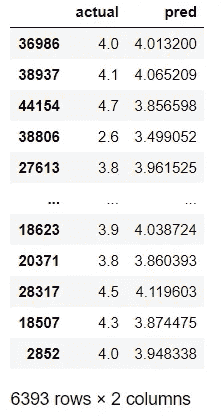

结果

**2.1 特征重要性**

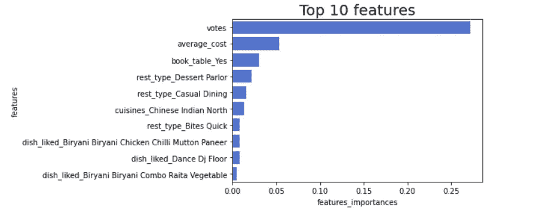

参考: [Git](https://github.com/erykml/medium_articles/blob/master/Machine%20Learning/feature_importance.ipynb)

# 摘要

我们从 CSV 文件中收集数据，一半的值丢失了，我们没有丢弃所有的值，而是尝试使用相关列填充适当的值，而不是删除空值。我们只尝试了 5 个一次性编码的功能，并尝试了不同的模型。随机森林回归器是最学习模型，因此我们使用网格搜索技术调整模型，最小 MSE = 0.03485。然后，我们在不同的模型上尝试了 7 个一次性编码的特性。随机森林回归器再次表现最佳。

然后，我们做了一些功能工程，使用响应编码功能，但这一次“线性回归”比以前表现得更好，随机森林回归器像往常一样赢得了比赛。

仅具有非空特征的随机森林回归量= = > 0 . 46686 . 38686868661

# 参考资料:

[https://towardsdatascience . com/explaining-feature-importance-by-example-of-a-random-forest-d 9166011959 e](https://towardsdatascience.com/explaining-feature-importance-by-example-of-a-random-forest-d9166011959e)[https://medium . com/@ purnasaigudikandula/zomato-Bangalore-restaurant-analysis-and-rating-prediction-df 277321 C7 CD](/@purnasaigudikandula/zomato-bangalore-restaurant-analysis-and-rating-prediction-df277321c7cd)[https://www . ka ggle . com/hinda mosh/funny-banglare-restaurants](https://www.kaggle.com/hindamosh/funny-banglore-restaurants-analysis)

# 谢谢你。请鼓掌或分享这个博客。

写下你的想法，将会在博客中再次发表。

**来看看我的**[**LinkedIn**](https://www.linkedin.com/in/brahm-parkash-12b2a8154/)简介